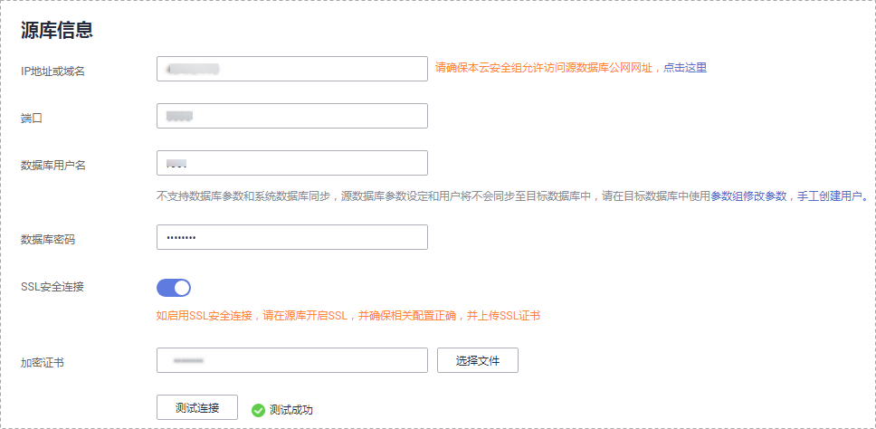

# 步骤一：创建同步任务

本小节以MySQL-\>RDS for MySQL的实时同步为示例，介绍如何使用数据复制服务创建两个数据库实例之间的实时同步任务，其他存储引擎的配置流程类似。

## 前提条件

-   已登录数据复制服务控制台。
-   账户余额大于等于0元。
-   满足实时同步支持的数据库类型，详情请参见[实时同步](https://support.huaweicloud.com/productdesc-drs/drs_01_0302.html)。
-   满足实时同步的使用限制，详情请参见[概述](概述(实时同步).md)。

## 操作步骤

1.  在“实时同步管理”页面，单击“创建同步任务”。
2.  在“同步实例”页面，填选区域、任务名称、任务异常通知设置、SMN主题、时延阈值、任务异常自动结束时间、描述、同步实例信息，单击“下一步”。

    **图 1**  同步任务信息  
    

    **表 1**  任务和描述

    
    <table><thead align="left"><tr id="row55731924204420"><th class="cellrowborder" valign="top" width="18.43%" id="mcps1.2.3.1.1">
<strong id="b1611223511352">参数</strong>

    </th>
    <th class="cellrowborder" valign="top" width="81.57%" id="mcps1.2.3.1.2">
<strong id="b3002268111352">描述</strong>

    </th>
    </tr>
    </thead>
    <tbody><tr id="row1459143619148"><td class="cellrowborder" valign="top" width="18.43%" headers="mcps1.2.3.1.1 ">
区域

    </td>
    <td class="cellrowborder" valign="top" width="81.57%" headers="mcps1.2.3.1.2 ">
当前所在区域，可进行切换。

    </td>
    </tr>
    <tr id="row807311204420"><td class="cellrowborder" valign="top" width="18.43%" headers="mcps1.2.3.1.1 ">
任务名称

    </td>
    <td class="cellrowborder" valign="top" width="81.57%" headers="mcps1.2.3.1.2 ">
任务名称在4-50位之间，必须以字母开头，不区分大小写，可以包含字母、数字、中划线或下划线，不能包含其他的特殊字符。

    </td>
    </tr>
    <tr id="row18223175312283"><td class="cellrowborder" valign="top" width="18.43%" headers="mcps1.2.3.1.1 ">
描述

    </td>
    <td class="cellrowborder" valign="top" width="81.57%" headers="mcps1.2.3.1.2 ">
描述不能超过256位，且不能包含! = &lt; &gt; &amp; ' " \ 特殊字符。

    </td>
    </tr>
    <tr id="row1080215433911"><td class="cellrowborder" valign="top" width="18.43%" headers="mcps1.2.3.1.1 ">
任务异常通知设置

    </td>
    <td class="cellrowborder" valign="top" width="81.57%" headers="mcps1.2.3.1.2 ">
该项为可选参数，开启之后，选择对应的SMN主题，。当同步任务状态异常时，系统将发送通知。

    </td>
    </tr>
    <tr id="row1238083594114"><td class="cellrowborder" valign="top" width="18.43%" headers="mcps1.2.3.1.1 ">
SMN主题

    </td>
    <td class="cellrowborder" valign="top" width="81.57%" headers="mcps1.2.3.1.2 ">
“任务异常通知设置”项开启后可见，需提前在SMN上申请主题并添加订阅。

    
SMN主题申请和订阅可参考<a href="https://support.huaweicloud.com/qs-smn/smn_ug_0004.html" target="_blank" rel="noopener noreferrer">《消息通知服务用户指南》</a>。

    </td>
    </tr>
    <tr id="row49611652175115"><td class="cellrowborder" valign="top" width="18.43%" headers="mcps1.2.3.1.1 ">
时延阈值

    </td>
    <td class="cellrowborder" valign="top" width="81.57%" headers="mcps1.2.3.1.2 ">
在增量同步阶段，源数据库和目标数据库之间的同步有时会存在一个时间差，称为时延，单位为秒。

    
时延阈值设置是指时延超过一定的值后（时延阈值范围为1—3600s），DRS可以发送告警通知给指定收件人。告警通知将在时延稳定超过设定的阈值6min后发送，避免出现由于时延波动反复发送告警通知的情况。

    
 说明： 
<ul id="ul163805916512"><li>首次进入增量同步阶段，会有较多数据等待同步，存在较大的时延，属于正常情况，不在此功能的监控范围之内。</li><li>设置时延阈值之前，需要设置任务异常通知。</li></ul>
    

    </td>
    </tr>
    <tr id="row157731032102814"><td class="cellrowborder" valign="top" width="18.43%" headers="mcps1.2.3.1.1 ">
任务异常自动结束时间（天）

    </td>
    <td class="cellrowborder" valign="top" width="81.57%" headers="mcps1.2.3.1.2 ">
设置任务异常自动结束天数，输入值必须在14-100之间。

    
 说明： 

异常状态下的任务仍然会计费，而长时间异常的任务无法续传和恢复。设置任务异常自动结束天数后，异常且超时的任务将会自动结束，以免产生不必要的费用。

    

    </td>
    </tr>
    </tbody>
    </table>

    **图 2**  同步实例信息  
    

    **表 2**  同步实例信息

    
    <table><thead align="left"><tr id="row39932329204436"><th class="cellrowborder" valign="top" width="23.87%" id="mcps1.2.3.1.1">
<strong id="b2587841611355">参数</strong>

    </th>
    <th class="cellrowborder" valign="top" width="76.13%" id="mcps1.2.3.1.2">
<strong id="b1577696211355">描述</strong>

    </th>
    </tr>
    </thead>
    <tbody><tr id="row05147381129"><td class="cellrowborder" valign="top" width="23.87%" headers="mcps1.2.3.1.1 ">
数据流动方向

    </td>
    <td class="cellrowborder" valign="top" width="76.13%" headers="mcps1.2.3.1.2 ">
选择“入云”，即目标端数据库为本云数据库。

    </td>
    </tr>
    <tr id="row0414184610580"><td class="cellrowborder" valign="top" width="23.87%" headers="mcps1.2.3.1.1 ">
源数据库引擎

    </td>
    <td class="cellrowborder" valign="top" width="76.13%" headers="mcps1.2.3.1.2 ">
选择MySQL。

    </td>
    </tr>
    <tr id="row42411630204436"><td class="cellrowborder" valign="top" width="23.87%" headers="mcps1.2.3.1.1 ">
目标数据库引擎

    </td>
    <td class="cellrowborder" valign="top" width="76.13%" headers="mcps1.2.3.1.2 ">
选择MySQL。

    </td>
    </tr>
    <tr id="row62907306204436"><td class="cellrowborder" valign="top" width="23.87%" headers="mcps1.2.3.1.1 ">
网络类型

    </td>
    <td class="cellrowborder" valign="top" width="76.13%" headers="mcps1.2.3.1.2 ">
此处以公网网络为示例。

    
可根据业务场景选择公网网络、VPC网络和VPN、专线网络。

    </td>
    </tr>
    <tr id="row658644204515"><td class="cellrowborder" valign="top" width="23.87%" headers="mcps1.2.3.1.1 ">
目标数据库实例

    </td>
    <td class="cellrowborder" valign="top" width="76.13%" headers="mcps1.2.3.1.2 ">
用户所创建的关系型数据库实例。

    
 说明： 
<ul id="ul11310133223113"><li>目标数据库实例不支持选择只读实例。</li><li>目标数据库实例可以和源数据库选择同一个实例。</li></ul>
    

    </td>
    </tr>
    <tr id="row18535204685911"><td class="cellrowborder" valign="top" width="23.87%" headers="mcps1.2.3.1.1 ">
同步实例所在子网

    </td>
    <td class="cellrowborder" valign="top" width="76.13%" headers="mcps1.2.3.1.2 ">
请选择同步实例所在的子网。也可以单击“查看子网”，跳转至“网络控制台”查看实例所在子网帮助选择。

    
默认值为当前所选数据库实例所在子网，请选择有可用IP地址的子网。为确保同步实例创建成功，仅显示已经开启DHCP的子网。

    </td>
    </tr>
    <tr id="row1169913195320"><td class="cellrowborder" valign="top" width="23.87%" headers="mcps1.2.3.1.1 ">
同步类型

    </td>
    <td class="cellrowborder" valign="top" width="76.13%" headers="mcps1.2.3.1.2 ">
此处以“全量+增量”为示例。

    <ul id="ul2014771574814"><li>“全量+增量”：
该模式为数据持续性实时同步，通过全量过程完成目标端数据库的初始化后，增量同步阶段通过解析日志等技术，将源端和目标端数据保持数据持续一致。

    
 说明： 

选择“全量+增量”同步模式，增量同步可以在全量同步完成的基础上实现数据的持续同步，无需中断业务，实现同步过程中源业务和数据库继续对外提供访问。

    

    </li></ul>
    <ul id="ul18666122394918"><li>“增量”：
增量同步通过解析日志等技术，将源端产生的增量实时同步至目标端。

    </li></ul>
    </td>
    </tr>
    <tr id="row19176153370"><td class="cellrowborder" valign="top" width="23.87%" headers="mcps1.2.3.1.1 ">
企业项目

    </td>
    <td class="cellrowborder" valign="top" width="76.13%" headers="mcps1.2.3.1.2 ">
对于已成功关联企业项目的用户，仅需在“企业项目”下拉框中选择目标项目。

    
如果需要自定义企业项目，请前往项目管理服务进行创建。关于如何创建项目，详见《项目管理用户指南》。

    </td>
    </tr>
    <tr id="row19432281410"><td class="cellrowborder" valign="top" width="23.87%" headers="mcps1.2.3.1.1 ">
标签

    </td>
    <td class="cellrowborder" valign="top" width="76.13%" headers="mcps1.2.3.1.2 ">
可选配置，对同步任务的标识。使用标签可方便管理您的实时同步任务。每个任务最多支持10个标签配额。

    
任务创建成功后，您可以单击实例名称，在“标签”页签下查看对应标签。关于标签的详细操作，请参见<a href="https://support.huaweicloud.com/usermanual-drs/drs_synchronization_tag.html" target="_blank" rel="noopener noreferrer">标签管理</a>。

    </td>
    </tr>
    </tbody>
    </table>

3.  同步实例创建成功后，在“源库及目标库”页面，填选源库信息和目标库信息后，单击“源库和目标库“处的“测试连接“，分别测试并确定与源库和目标库连通后，勾选协议，单击“下一步“。

    入云和出云场景中源库和目标库需要填选的信息不同，具体以界面为准。

    -   入云场景。

        **图 3**  入云同步源库信息  
        

        **表 3**  源库信息

        
        <table><thead align="left"><tr id="row3718104811221"><th class="cellrowborder" valign="top" width="23.29%" id="mcps1.2.3.1.1">
<strong id="b17718124814224">参数</strong>

        </th>
        <th class="cellrowborder" valign="top" width="76.71%" id="mcps1.2.3.1.2">
<strong id="b1171812480223">描述</strong>

        </th>
        </tr>
        </thead>
        <tbody><tr id="row18719124822211"><td class="cellrowborder" valign="top" width="23.29%" headers="mcps1.2.3.1.1 ">
IP地址或域名

        </td>
        <td class="cellrowborder" valign="top" width="76.71%" headers="mcps1.2.3.1.2 ">
源数据库的IP地址或域名。

        </td>
        </tr>
        <tr id="row20719048182217"><td class="cellrowborder" valign="top" width="23.29%" headers="mcps1.2.3.1.1 ">
端口

        </td>
        <td class="cellrowborder" valign="top" width="76.71%" headers="mcps1.2.3.1.2 ">
源数据库服务端口，可输入范围为1~65535间的整数。

        </td>
        </tr>
        <tr id="row2071994852215"><td class="cellrowborder" valign="top" width="23.29%" headers="mcps1.2.3.1.1 ">
数据库用户名

        </td>
        <td class="cellrowborder" valign="top" width="76.71%" headers="mcps1.2.3.1.2 ">
源数据库的用户名。

        </td>
        </tr>
        <tr id="row6719114832212"><td class="cellrowborder" valign="top" width="23.29%" headers="mcps1.2.3.1.1 ">
数据库密码

        </td>
        <td class="cellrowborder" valign="top" width="76.71%" headers="mcps1.2.3.1.2 ">
源数据库用户名所对应的密码。支持在任务创建后修改密码。

        
任务为启动中、全量同步、增量同步、增量同步失败状态时，可在“基本信息”页面的“同步信息”区域，单击“源库密码”后的“替换密码”，在弹出的对话框中修改密码。

        </td>
        </tr>
        <tr id="row87192483227"><td class="cellrowborder" valign="top" width="23.29%" headers="mcps1.2.3.1.1 ">
SSL安全连接

        </td>
        <td class="cellrowborder" valign="top" width="76.71%" headers="mcps1.2.3.1.2 ">
通过该功能，用户可以选择是否开启对迁移链路的加密。如果开启该功能，需要用户上传SSL CA根证书。

        
 说明： 
<ul id="ul17719548112214"><li>最大支持上传500KB的证书文件。</li><li>如果不使用SSL证书，请自行承担数据安全风险。</li></ul>
        

        </td>
        </tr>
        </tbody>
        </table>

        > **说明：** 
        >**源数据库IP地址、端口、用户名和密码将在同步过程中被加密暂存到数据库和同步实例主机上，待该任务删除后会永久清除。**

        **图 4**  入云同步目标库信息  
        

        **表 4**  目标库信息

        
        <table><thead align="left"><tr id="row1272034882214"><th class="cellrowborder" valign="top" width="23%" id="mcps1.2.3.1.1">
<strong id="b107201248152214">参数</strong>

        </th>
        <th class="cellrowborder" valign="top" width="77%" id="mcps1.2.3.1.2">
<strong id="b16720648152219">描述</strong>

        </th>
        </tr>
        </thead>
        <tbody><tr id="row57201348122212"><td class="cellrowborder" valign="top" width="23%" headers="mcps1.2.3.1.1 ">
数据库实例名称

        </td>
        <td class="cellrowborder" valign="top" width="77%" headers="mcps1.2.3.1.2 ">
默认为创建迁移任务时选择的关系型数据库实例，不可进行修改。

        </td>
        </tr>
        <tr id="row107201648162212"><td class="cellrowborder" valign="top" width="23%" headers="mcps1.2.3.1.1 ">
数据库用户名

        </td>
        <td class="cellrowborder" valign="top" width="77%" headers="mcps1.2.3.1.2 ">
目标数据库对应的用户名。

        </td>
        </tr>
        <tr id="row157204488221"><td class="cellrowborder" valign="top" width="23%" headers="mcps1.2.3.1.1 ">
数据库密码

        </td>
        <td class="cellrowborder" valign="top" width="77%" headers="mcps1.2.3.1.2 ">
目标数据库用户名对应的密码。支持在任务创建后修改密码。

        
任务为启动中、全量同步、增量同步、增量同步失败状态时，可在“基本信息”页面的“同步信息”区域，单击“目标库密码”后的“替换密码”，在弹出的对话框中修改密码。

        </td>
        </tr>
        </tbody>
        </table>

        > **说明：** 
        >**目标数据库用户名和密码将在同步过程中被加密暂存到数据库和同步实例主机上，待该任务删除后会永久清除。**

    -   出云场景。

        **图 5**  出云同步源库信息  
        

        **表 5**  源库信息

        
        <table><thead align="left"><tr id="row1072114483221"><th class="cellrowborder" valign="top" width="23%" id="mcps1.2.3.1.1">
<strong id="b137211148102213">参数</strong>

        </th>
        <th class="cellrowborder" valign="top" width="77%" id="mcps1.2.3.1.2">
<strong id="b1372111482222">描述</strong>

        </th>
        </tr>
        </thead>
        <tbody><tr id="row17721104812224"><td class="cellrowborder" valign="top" width="23%" headers="mcps1.2.3.1.1 ">
数据库实例名称

        </td>
        <td class="cellrowborder" valign="top" width="77%" headers="mcps1.2.3.1.2 ">
默认为创建任务时选择的云数据库实例，不可进行修改。

        </td>
        </tr>
        <tr id="row1772174810220"><td class="cellrowborder" valign="top" width="23%" headers="mcps1.2.3.1.1 ">
数据库用户名

        </td>
        <td class="cellrowborder" valign="top" width="77%" headers="mcps1.2.3.1.2 ">
源数据库对应的用户名。

        </td>
        </tr>
        <tr id="row57211048172213"><td class="cellrowborder" valign="top" width="23%" headers="mcps1.2.3.1.1 ">
数据库密码

        </td>
        <td class="cellrowborder" valign="top" width="77%" headers="mcps1.2.3.1.2 ">
源数据库用户名对应的密码。

        
任务为启动中、全量同步、增量同步、增量同步失败状态时，可在“基本信息”页面的“同步信息”区域，单击“源库密码”后的“替换密码”，在弹出的对话框中修改密码。

        </td>
        </tr>
        </tbody>
        </table>

        > **说明：** 
        >**源数据库的用户名和密码将在同步过程中被加密暂存到数据库和同步实例主机上，待该任务删除后会永久清除。**

        **图 6**  出云同步目标库信息  
        

        **表 6**  目标库信息

        
        <table><thead align="left"><tr id="row6722184815225"><th class="cellrowborder" valign="top" width="23.29%" id="mcps1.2.3.1.1">
<strong id="b87222485222">参数</strong>

        </th>
        <th class="cellrowborder" valign="top" width="76.71%" id="mcps1.2.3.1.2">
<strong id="b87221548172213">描述</strong>

        </th>
        </tr>
        </thead>
        <tbody><tr id="row77220482224"><td class="cellrowborder" valign="top" width="23.29%" headers="mcps1.2.3.1.1 ">
IP地址或域名

        </td>
        <td class="cellrowborder" valign="top" width="76.71%" headers="mcps1.2.3.1.2 ">
目标数据库的IP地址或域名。

        </td>
        </tr>
        <tr id="row372264813224"><td class="cellrowborder" valign="top" width="23.29%" headers="mcps1.2.3.1.1 ">
端口

        </td>
        <td class="cellrowborder" valign="top" width="76.71%" headers="mcps1.2.3.1.2 ">
目标数据库服务端口，可输入范围为1~65535间的整数。

        </td>
        </tr>
        <tr id="row272294872216"><td class="cellrowborder" valign="top" width="23.29%" headers="mcps1.2.3.1.1 ">
数据库用户名

        </td>
        <td class="cellrowborder" valign="top" width="76.71%" headers="mcps1.2.3.1.2 ">
目标数据库的用户名。

        </td>
        </tr>
        <tr id="row2723048202215"><td class="cellrowborder" valign="top" width="23.29%" headers="mcps1.2.3.1.1 ">
数据库密码

        </td>
        <td class="cellrowborder" valign="top" width="76.71%" headers="mcps1.2.3.1.2 ">
目标数据库的用户名所对应的密码。支持在任务创建后修改密码。

        
任务为启动中、全量同步、增量同步、增量同步失败状态时，可在“基本信息”页面的“同步信息”区域，单击“目标库密码”后的“替换密码”，在弹出的对话框中修改密码。

        </td>
        </tr>
        <tr id="row2723134816223"><td class="cellrowborder" valign="top" width="23.29%" headers="mcps1.2.3.1.1 ">
SSL安全连接

        </td>
        <td class="cellrowborder" valign="top" width="76.71%" headers="mcps1.2.3.1.2 ">
通过该功能，用户可以选择是否开启对迁移链路的加密。如果开启该功能，需要用户上传SSL CA根证书。

        
 说明： 

最大支持上传500KB的证书文件。

        

        </td>
        </tr>
        </tbody>
        </table>

        > **说明：** 
        >**目标数据库的IP地址、端口、用户名和密码将在同步过程中被加密暂存到数据库和同步实例主机上，待该任务删除后会永久清除。**

4.  在“设置同步“页面，选择数据冲突策略和同步对象，单击“下一步“。

    **图 7**  同步模式  
    

    **表 7**  同步模式和对象

    
    <table><thead align="left"><tr id="row165921632141911"><th class="cellrowborder" valign="top" width="16.24%" id="mcps1.2.3.1.1">
<strong id="b1783318515228">参数</strong>

    </th>
    <th class="cellrowborder" valign="top" width="83.76%" id="mcps1.2.3.1.2">
<strong id="b10555114922418">描述</strong>

    </th>
    </tr>
    </thead>
    <tbody><tr id="row19367182916553"><td class="cellrowborder" valign="top" width="16.24%" headers="mcps1.2.3.1.1 ">
冲突策略

    </td>
    <td class="cellrowborder" valign="top" width="83.76%" headers="mcps1.2.3.1.2 ">
数据复制服务提供的实时同步功能使用了主键或唯一键冲突策略，这些策略可以由您自主选择，尽可能保证源数据库中有主键约束或唯一键约束的表同步到目标数据库是符合预期的。

    
冲突策略目前支持如下三种形式：

    <ul id="ul4261248155512"><li>忽略
当同步数据与目标数据库已有数据冲突时（主键/唯一键存在重复等），将跳过冲突数据，继续进行后续同步。

    </li><li>报错
当同步数据与目标数据库已有数据冲突时（主键/唯一键存在重复等），同步任务将失败并立即中止。

    </li><li>覆盖
当同步数据与目标数据库已有数据冲突时（主键/唯一键存在重复等），将覆盖原来的冲突数据。

    </li></ul>
    
当数据发生冲突时，针对如下情况，建议选择“忽略”或者“覆盖”，否则建议选择“报错”：

    <ul id="ul366812291748"><li>目标数据库存在数据</li><li>多对一同步场景</li><li>目标数据库手动更新数据</li></ul>
    </td>
    </tr>
    <tr id="row16476034203"><td class="cellrowborder" valign="top" width="16.24%" headers="mcps1.2.3.1.1 ">
是否过滤DROP DATABASE

    </td>
    <td class="cellrowborder" valign="top" width="83.76%" headers="mcps1.2.3.1.2 ">
实时同步过程中，源数据库端执行的DDL操作在一定程度上会影响数据的同步能力，为了降低同步数据的风险，数据复制服务提供了过滤DDL操作的功能。

    
目前支持默认过滤删除数据库的操作。

    <ul id="ul182971235135112"><li>是，表示实时同步过程中不会同步用户在源数据库端执行的删除数据库的操作。</li><li>否，则表示实时同步过程中将相关操作同步到目标库。
 说明： 

目前仅以下链路的数据同步场景支持过滤DDL操作。

    <ul id="ul580314337811"><li>MySQL数据库-&gt;RDS for MySQL实例</li><li>MySQL数据库-&gt;RDS for PostgreSQL实例</li><li>MySQL数据库-&gt;GaussDB(for openGauss)实例</li><li>DDM实例-&gt;RDS for MySQL实例</li><li>RDS for MySQL实例-&gt;MySQL数据库</li></ul>
    

    </li></ul>
    </td>
    </tr>
    <tr id="row1244143720811"><td class="cellrowborder" valign="top" width="16.24%" headers="mcps1.2.3.1.1 ">
对象同步范围

    </td>
    <td class="cellrowborder" valign="top" width="83.76%" headers="mcps1.2.3.1.2 ">
对象同步范围支持普通索引和增量DDL同步。您可以根据业务需求选择是否进行同步。

    </td>
    </tr>
    <tr id="row559273214193"><td class="cellrowborder" valign="top" width="16.24%" headers="mcps1.2.3.1.1 ">
同步对象

    </td>
    <td class="cellrowborder" valign="top" width="83.76%" headers="mcps1.2.3.1.2 ">
同步对象支持库级和表级同步，您可以根据业务场景选择对应的数据进行同步。部分链路还支持文件导入对象。
<b>图1 </b>导入对象文件 

    

    
如果有切换源数据库的操作或源库同步对象变化的情况，请务必在选择同步对象前单击右上角的，以确保待选择的对象为最新源数据库对象。
 说明： 

选择对象的时候支持搜索，以便您快速选择需要的数据库对象。

    

    

    
实时同步功能可以支持源数据库和目标数据库中的同步对象（包括数据库、schema、表）的名称不同。如果同步的数据库对象在源数据库和目标数据库中的命名不同，那么可以使用数据复制服务提供的对象名映射功能进行映射。其中包括：库映射、schema映射、表映射。

    
对象名映射的具体操作请参考《数据复制服务用户指南》中“<a href="https://support.huaweicloud.com/usermanual-drs/drs_10_0015.html" target="_blank" rel="noopener noreferrer">对象名映射</a>”章节。

    
导入对象文件的具体操作如下：

    <ol id="ol5985111318458"><li>单击“下载模板”。</li><li>在下载的Excel模板中，填写需要导入的对象信息。</li><li>单击“添加文件”，在对话框中选择编辑完成的模板。</li><li>单击“上传文件”。
 说明： 
<ul id="ul127396547493"><li>文件导入仅支持导入Windows Microsoft Excel 97-2003版本（*.xls），2007及以上版本（*.xlsx）的文件，下载的压缩包提供上述两个版本模板。</li><li>文件名支持的有效字符范围：汉字，空格，大小写字母，数字，“-”，“_”，“(”，“)”。</li><li>模板中的对象信息需按照SchemaName.TableName的格式进行填写，不允许包含“&lt;”，“&gt;”，"."和“"”，不支持以空格开头或结尾的对象，且大小写敏感。</li><li>配置中的任务，可使用“表级同步”，“库级同步”或“文件导入”三种方式，每次切换新的方式后，当前选择或者导入的数据库对象被清空，需重新选择或导入。</li><li>可映射的文件导入，必须严格按照模板分别填写第一列和第二列，均不可为空，如果某行的两列均为空时，会忽略该行。</li><li>选择文件导入功能所创建的任务，任务启动之后再编辑时，不支持切换到“表级同步”和“库级同步”功能。</li><li>任务再编辑时，导入的文件必须包含全量对象信息，不支持导入增删的对象信息。</li><li>任务再编辑时，已经同步的对象不支持再次映射，请保持其映射后的对象名称不变。</li><li>任务再编辑时导出的对象信息，是已经同步的对象信息。</li><li>上传文件后校验失败，可单击“查看失败详情”下载错误信息。</li></ul>
    

    </li></ol>
    </td>
    </tr>
    </tbody>
    </table>

5.  在“数据加工”页面，根据需要选择数据加工的方式。

    -   如果不需要数据加工，单击“下一步”。
    -   如果需要数据加工，可选择“列加工”或“数据过滤”，参考[数据加工](https://support.huaweicloud.com/usermanual-drs/drs_03_0035.html)，设置相关规则。

    **图 9**  数据加工  
    

6.  在“预检查“页面，进行同步任务预校验，校验是否可进行实时同步。
    -   查看检查结果，如有不通过的检查项，需要修复不通过项后，单击“重新校验”按钮重新进行任务预校验。

        预检查不通过项处理建议请参见《数据复制服务用户指南》中的“[预检查不通过项修复方法](https://support.huaweicloud.com/usermanual-drs/drs_precheck.html)”。

    -   预检查完成后，且所有检查项结果均通过时，单击“下一步“。

        **图 10**  同步预检查  
        

        > **说明：** 
        >所有检查项结果均通过时，若存在请确认项，需要阅读并确认详情后才可以继续执行下一步操作。

7.  在“任务确认“页面，设置同步任务的启动时间，并确认同步任务信息无误后，勾选协议，单击“启动任务“，提交同步任务。

    > **说明：** 
    >-   同步任务的启动时间可以根据业务需求，设置为“立即启动”或“稍后启动”。
    >-   预计同步任务启动后，会对源数据库和目标数据库的性能产生影响，建议选择业务低峰期，合理设置同步任务的启动时间。

8.  同步任务提交后，您可在“实时同步管理“页面，查看并管理自己的任务。
    -   您可查看任务提交后的状态，状态请参见[参考：任务状态含义](任务状态(实时同步).md)。
    -   在任务列表的右上角，单击刷新列表，可查看到最新的任务状态。

