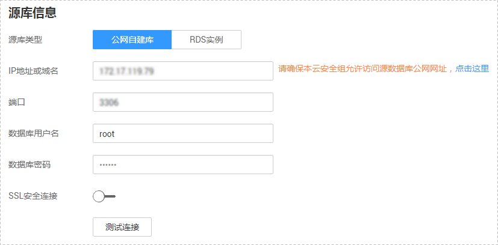
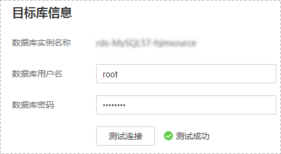
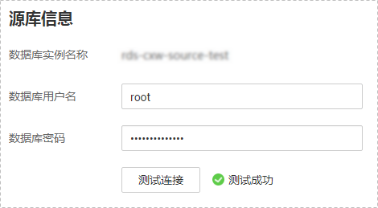
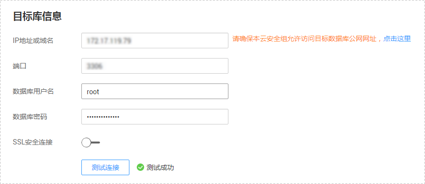
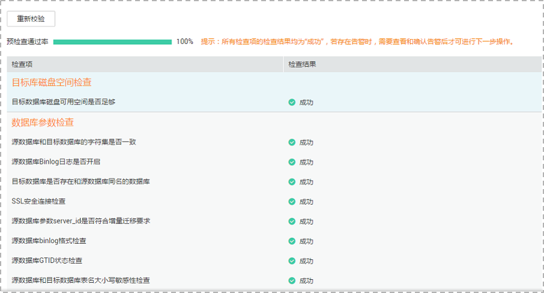
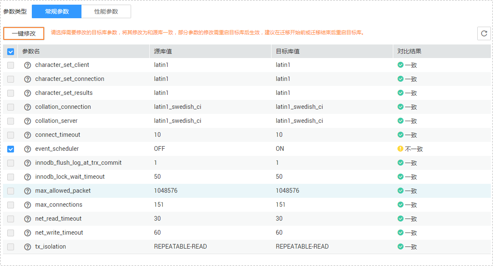
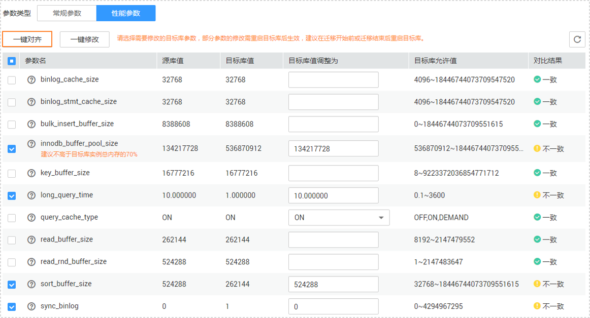
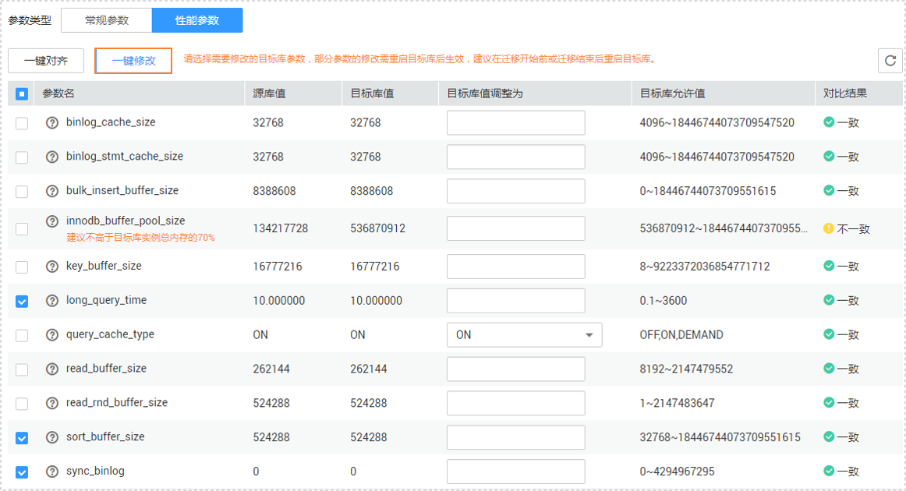

# 步骤一：创建灾备任务

本章节将以MySQL到RDS for MySQL的灾备场景为示例，介绍在公网网络场景下，通过数据复制服务管理控制台配置数据灾备任务的流程，其他存储引擎的配置流程类似。

在数据复制服务中，数据库灾备是通过任务的形式完成的，通过创建任务，可以完成任务信息配置、任务创建。灾备任务创建成功后，您也可以通过数据复制服务管理控制台，对任务进行管理。

## 前提条件

-   已登录数据复制服务控制台。
-   账户余额大于等于0元。
-   参见[多活灾备](https://support.huaweicloud.com/productdesc-drs/drs_01_0305.html)。
-   参见[使用须知](使用须知（多活灾备）.md)。

## 操作步骤

1.  在“多活灾备管理“页面，单击“创建灾备任务“，进入创建灾备任务页面。
2.  在“灾备实例”页面，填选任务名称、任务异常通知收件人、描述、迁移实例信息，单击“下一步”。

    **图 1**  灾备任务信息  
    

    **表 1**  任务和描述

    
    <table><thead align="left"><tr id="row55731924204420"><th class="cellrowborder" valign="top" width="18.42%" id="mcps1.2.3.1.1">
<strong id="b1611223511352">参数</strong>

    </th>
    <th class="cellrowborder" valign="top" width="81.58%" id="mcps1.2.3.1.2">
<strong id="b3002268111352">描述</strong>

    </th>
    </tr>
    </thead>
    <tbody><tr id="row807311204420"><td class="cellrowborder" valign="top" width="18.42%" headers="mcps1.2.3.1.1 ">
任务名称

    </td>
    <td class="cellrowborder" valign="top" width="81.58%" headers="mcps1.2.3.1.2 ">
任务名称在4位到64位之间，必须以字母开头，不区分大小写，可以包含字母、数字、中划线或下划线，不能包含其他的特殊字符。

    </td>
    </tr>
    <tr id="row1080215433911"><td class="cellrowborder" valign="top" width="18.42%" headers="mcps1.2.3.1.1 ">
任务异常通知设置

    </td>
    <td class="cellrowborder" valign="top" width="81.58%" headers="mcps1.2.3.1.2 ">
该项为可选参数，开启之后，需要填写手机号码或者邮箱作为指定收件人。当迁移任务状态异常时，系统将发送通知给指定收件人。

    
 说明： 

收到确认短信或邮件之后，需要在48小时内处理，否则该功能订阅无效。

    

    </td>
    </tr>
    <tr id="row157731032102814"><td class="cellrowborder" valign="top" width="18.42%" headers="mcps1.2.3.1.1 ">
时延阈值

    </td>
    <td class="cellrowborder" valign="top" width="81.58%" headers="mcps1.2.3.1.2 ">
在数据灾备阶段，业务数据库和灾备数据库之间的数据同步有时会存在一个时间差，称为时延，单位为秒。

    
时延阈值设置是指时延超过一定的值后（时间阈值范围为1—3600s），DRS可以发送告警通知给指定收件人。告警通知将在时延稳定超过设定的阈值6min后发送，避免出现由于时延波动反复发送告警通知的情况。

    
 说明： 

设置时间阈值之前，需要填写收件人手机号或邮箱。

    

    </td>
    </tr>
    <tr id="row23664659204420"><td class="cellrowborder" valign="top" width="18.42%" headers="mcps1.2.3.1.1 ">
描述

    </td>
    <td class="cellrowborder" valign="top" width="81.58%" headers="mcps1.2.3.1.2 ">
描述不能超过256位，且不能包含!=&lt;&gt;&amp;'"特殊字符。

    </td>
    </tr>
    </tbody>
    </table>

    **图 2**  灾备实例信息  
    

    **表 2**  灾备实例信息

    
    <table><thead align="left"><tr id="row39932329204436"><th class="cellrowborder" valign="top" width="23.87%" id="mcps1.2.3.1.1">
<strong id="b2587841611355">参数</strong>

    </th>
    <th class="cellrowborder" valign="top" width="76.13%" id="mcps1.2.3.1.2">
<strong id="b1577696211355">描述</strong>

    </th>
    </tr>
    </thead>
    <tbody><tr id="row138141831164212"><td class="cellrowborder" valign="top" width="23.87%" headers="mcps1.2.3.1.1 ">
灾备关系

    </td>
    <td class="cellrowborder" valign="top" width="76.13%" headers="mcps1.2.3.1.2 ">
选择“本云为备”。

    
灾备关系可以为“本云为备”或者“本云为主”，默认选择“本云为备”。

    </td>
    </tr>
    <tr id="row0414184610580"><td class="cellrowborder" valign="top" width="23.87%" headers="mcps1.2.3.1.1 ">
业务数据库引擎

    </td>
    <td class="cellrowborder" valign="top" width="76.13%" headers="mcps1.2.3.1.2 ">
选择MySQL。

    
目前仅支持MySQL数据库。

    </td>
    </tr>
    <tr id="row42411630204436"><td class="cellrowborder" valign="top" width="23.87%" headers="mcps1.2.3.1.1 ">
灾备数据库引擎

    </td>
    <td class="cellrowborder" valign="top" width="76.13%" headers="mcps1.2.3.1.2 ">
选择MySQL。

    
目前仅支持MySQL数据库。

    </td>
    </tr>
    <tr id="row62907306204436"><td class="cellrowborder" valign="top" width="23.87%" headers="mcps1.2.3.1.1 ">
网络类型

    </td>
    <td class="cellrowborder" valign="top" width="76.13%" headers="mcps1.2.3.1.2 ">
此处以公网网络为示例。

    
默认为公网网络类型，支持VPN网络、专线网络、公网网络。

    </td>
    </tr>
    <tr id="row658644204515"><td class="cellrowborder" valign="top" width="23.87%" headers="mcps1.2.3.1.1 ">
灾备数据库实例

    </td>
    <td class="cellrowborder" valign="top" width="76.13%" headers="mcps1.2.3.1.2 ">
用户所创建的灾备关系型数据库实例。

    </td>
    </tr>
    <tr id="row549475311111"><td class="cellrowborder" valign="top" width="23.87%" headers="mcps1.2.3.1.1 ">
业务数据库实例

    </td>
    <td class="cellrowborder" valign="top" width="76.13%" headers="mcps1.2.3.1.2 ">
用户所创建的业务关系型数据库实例。灾备关系为“本云为主”时，该选项可见。

    </td>
    </tr>
    <tr id="row956511587287"><td class="cellrowborder" valign="top" width="23.87%" headers="mcps1.2.3.1.1 ">
灾备库读写设置

    </td>
    <td class="cellrowborder" valign="top" width="76.13%" headers="mcps1.2.3.1.2 "><ul id="ul441372842315"><li>只读
灾备中，灾备数据库将转化为只读、不可写入的状态，通过“灾备监控”界面的“本云数据库升主”功能，可以使灾备数据库（目标库）变为业务数据库，此时数据库将变为读写状态。灾备任务结束/删除后，灾备数据库也将变为读写状态。

    </li></ul>
    </td>
    </tr>
    <tr id="row133503819303"><td class="cellrowborder" valign="top" width="23.87%" headers="mcps1.2.3.1.1 ">
标签

    </td>
    <td class="cellrowborder" valign="top" width="76.13%" headers="mcps1.2.3.1.2 ">
可选配置，对灾备任务的标识。使用标签可方便管理您的灾备任务。每个任务最多支持10个标签配额。

    
任务创建成功后，您可以单击实例名称，在“标签”页签下查看对应标签。关于标签的详细操作，请参见<a href="https://support.huaweicloud.com/usermanual-drs/drs_disaster_tag.html" target="_blank" rel="noopener noreferrer">标签管理</a>。

    </td>
    </tr>
    </tbody>
    </table>

3.  在“源库及目标库”页面，灾备实例创建成功后，填选业务数据库信息和灾备数据库信息，建议您单击“源库和目标库“处的“测试连接“，分别测试并确定与业务库和灾备库连通后，勾选协议，单击“下一步“。
    -   [步骤2](#li4516889420249)中的“灾备关系“选择“本云为备“。

        **图 3**  业务数据库信息  
        

        **表 3**  业务数据库信息

        
        <table><thead align="left"><tr id="row13217143113487"><th class="cellrowborder" valign="top" width="23.32%" id="mcps1.2.3.1.1">
<strong id="b132171331164818">参数</strong>

        </th>
        <th class="cellrowborder" valign="top" width="76.68%" id="mcps1.2.3.1.2">
<strong id="b7217103104817">描述</strong>

        </th>
        </tr>
        </thead>
        <tbody><tr id="row14589204111270"><td class="cellrowborder" valign="top" width="23.32%" headers="mcps1.2.3.1.1 ">
源库类型

        </td>
        <td class="cellrowborder" valign="top" width="76.68%" headers="mcps1.2.3.1.2 ">
默认选择“公网自建库”。

        
源库类型可以为“公网自建库”，或“RDS实例”。RDS实例只有在网络类型为“公网网络”时可选。

        </td>
        </tr>
        <tr id="row172171131134812"><td class="cellrowborder" valign="top" width="23.32%" headers="mcps1.2.3.1.1 ">
IP地址或域名

        </td>
        <td class="cellrowborder" valign="top" width="76.68%" headers="mcps1.2.3.1.2 ">
业务数据库的IP地址或域名。

        </td>
        </tr>
        <tr id="row15218331174810"><td class="cellrowborder" valign="top" width="23.32%" headers="mcps1.2.3.1.1 ">
端口

        </td>
        <td class="cellrowborder" valign="top" width="76.68%" headers="mcps1.2.3.1.2 ">
业务数据库服务端口，可输入范围为1~65535间的整数。

        </td>
        </tr>
        <tr id="row5218143118481"><td class="cellrowborder" valign="top" width="23.32%" headers="mcps1.2.3.1.1 ">
数据库用户名

        </td>
        <td class="cellrowborder" valign="top" width="76.68%" headers="mcps1.2.3.1.2 ">
业务数据库的用户名。

        </td>
        </tr>
        <tr id="row9218631144819"><td class="cellrowborder" valign="top" width="23.32%" headers="mcps1.2.3.1.1 ">
数据库密码

        </td>
        <td class="cellrowborder" valign="top" width="76.68%" headers="mcps1.2.3.1.2 ">
业务数据库的用户名所对应的密码。

        </td>
        </tr>
        <tr id="row1821833144818"><td class="cellrowborder" valign="top" width="23.32%" headers="mcps1.2.3.1.1 ">
SSL安全连接

        </td>
        <td class="cellrowborder" valign="top" width="76.68%" headers="mcps1.2.3.1.2 ">
通过该功能，用户可以选择是否开启对迁移链路的加密。如果开启该功能，需要用户上传SSL CA根证书。

        
 说明： 

最大支持上传500KB的证书文件。

        

        </td>
        </tr>
        <tr id="row135581623193918"><td class="cellrowborder" valign="top" width="23.32%" headers="mcps1.2.3.1.1 ">
区域

        </td>
        <td class="cellrowborder" valign="top" width="76.68%" headers="mcps1.2.3.1.2 ">
业务数据库RDS实例所在区域，不支持选择本区域。源库类型可以为“RDS实例”时，该选项可见。

        </td>
        </tr>
        <tr id="row595622718396"><td class="cellrowborder" valign="top" width="23.32%" headers="mcps1.2.3.1.1 ">
数据库实例名称

        </td>
        <td class="cellrowborder" valign="top" width="76.68%" headers="mcps1.2.3.1.2 ">
业务数据库实例名称。源库类型可以为“RDS实例”时，该选项可见。

        </td>
        </tr>
        <tr id="row104381634103914"><td class="cellrowborder" valign="top" width="23.32%" headers="mcps1.2.3.1.1 ">
数据库用户名

        </td>
        <td class="cellrowborder" valign="top" width="76.68%" headers="mcps1.2.3.1.2 ">
业务数据库用户名称。源库类型可以为“RDS实例”时，该选项可见。

        </td>
        </tr>
        <tr id="row1649294433913"><td class="cellrowborder" valign="top" width="23.32%" headers="mcps1.2.3.1.1 ">
数据库密码

        </td>
        <td class="cellrowborder" valign="top" width="76.68%" headers="mcps1.2.3.1.2 ">
业务数据库的数据库用户密码。源库类型可以为“RDS实例”时，该选项可见。

        </td>
        </tr>
        </tbody>
        </table>

        > **说明：**   
        >**业务数据库的IP地址或域名、数据库用户名和密码，会被系统加密暂存，直至删除该迁移任务后自动清除。**  

        **图 4**  灾备数据库信息  
        

        **表 4**  灾备数据库信息

        
        <table><thead align="left"><tr id="row16220183114480"><th class="cellrowborder" valign="top" width="23%" id="mcps1.2.3.1.1">
<strong id="b521913316481">参数</strong>

        </th>
        <th class="cellrowborder" valign="top" width="77%" id="mcps1.2.3.1.2">
<strong id="b522033184811">描述</strong>

        </th>
        </tr>
        </thead>
        <tbody><tr id="row112201231134817"><td class="cellrowborder" valign="top" width="23%" headers="mcps1.2.3.1.1 ">
数据库实例名称

        </td>
        <td class="cellrowborder" valign="top" width="77%" headers="mcps1.2.3.1.2 ">
默认为创建灾备任务时选择的数据库实例，不可进行修改。

        </td>
        </tr>
        <tr id="row4220203120489"><td class="cellrowborder" valign="top" width="23%" headers="mcps1.2.3.1.1 ">
数据库用户名

        </td>
        <td class="cellrowborder" valign="top" width="77%" headers="mcps1.2.3.1.2 ">
灾备数据库对应的数据库用户名。

        </td>
        </tr>
        <tr id="row922018318480"><td class="cellrowborder" valign="top" width="23%" headers="mcps1.2.3.1.1 ">
数据库密码

        </td>
        <td class="cellrowborder" valign="top" width="77%" headers="mcps1.2.3.1.2 ">
灾备数据库对应的用户名密码。

        
数据库用户名和密码将被系统加密暂存，直至该任务删除后清除。

        </td>
        </tr>
        </tbody>
        </table>

    -   [步骤2](#li4516889420249)中的“灾备关系“选择“本云为主“。

        **图 5**  业务数据库信息  
        

        **表 5**  业务数据库信息

        
        <table><thead align="left"><tr id="row8139436105618"><th class="cellrowborder" valign="top" width="23%" id="mcps1.2.3.1.1">
<strong id="b1513933605615">参数</strong>

        </th>
        <th class="cellrowborder" valign="top" width="77%" id="mcps1.2.3.1.2">
<strong id="b14139133685610">描述</strong>

        </th>
        </tr>
        </thead>
        <tbody><tr id="row914014367561"><td class="cellrowborder" valign="top" width="23%" headers="mcps1.2.3.1.1 ">
数据库实例名称

        </td>
        <td class="cellrowborder" valign="top" width="77%" headers="mcps1.2.3.1.2 ">
默认为创建灾备任务时选择的数据库实例，不可进行修改。

        </td>
        </tr>
        <tr id="row7140133619568"><td class="cellrowborder" valign="top" width="23%" headers="mcps1.2.3.1.1 ">
数据库用户名

        </td>
        <td class="cellrowborder" valign="top" width="77%" headers="mcps1.2.3.1.2 ">
业务数据库对应的数据库用户名。

        </td>
        </tr>
        <tr id="row191402361562"><td class="cellrowborder" valign="top" width="23%" headers="mcps1.2.3.1.1 ">
数据库密码

        </td>
        <td class="cellrowborder" valign="top" width="77%" headers="mcps1.2.3.1.2 ">
业务数据库对应的用户名密码。

        
数据库用户名和密码将被系统加密暂存，直至该任务删除后清除。

        </td>
        </tr>
        </tbody>
        </table>

        **图 6**  灾备数据库信息  
        

        **表 6**  灾备数据库信息

        
        <table><thead align="left"><tr id="row16141153615564"><th class="cellrowborder" valign="top" width="23.32%" id="mcps1.2.3.1.1">
<strong id="b1414110368564">参数</strong>

        </th>
        <th class="cellrowborder" valign="top" width="76.68%" id="mcps1.2.3.1.2">
<strong id="b01411836105613">描述</strong>

        </th>
        </tr>
        </thead>
        <tbody><tr id="row314119365568"><td class="cellrowborder" valign="top" width="23.32%" headers="mcps1.2.3.1.1 ">
IP地址或域名

        </td>
        <td class="cellrowborder" valign="top" width="76.68%" headers="mcps1.2.3.1.2 ">
业务数据库的IP地址或域名。

        </td>
        </tr>
        <tr id="row1314133613565"><td class="cellrowborder" valign="top" width="23.32%" headers="mcps1.2.3.1.1 ">
端口

        </td>
        <td class="cellrowborder" valign="top" width="76.68%" headers="mcps1.2.3.1.2 ">
业务数据库服务端口，可输入范围为1~65535间的整数。

        </td>
        </tr>
        <tr id="row314263645612"><td class="cellrowborder" valign="top" width="23.32%" headers="mcps1.2.3.1.1 ">
数据库用户名

        </td>
        <td class="cellrowborder" valign="top" width="76.68%" headers="mcps1.2.3.1.2 ">
业务数据库的用户名。

        </td>
        </tr>
        <tr id="row4142536105616"><td class="cellrowborder" valign="top" width="23.32%" headers="mcps1.2.3.1.1 ">
数据库密码

        </td>
        <td class="cellrowborder" valign="top" width="76.68%" headers="mcps1.2.3.1.2 ">
业务数据库的用户名所对应的密码。

        </td>
        </tr>
        <tr id="row31428366564"><td class="cellrowborder" valign="top" width="23.32%" headers="mcps1.2.3.1.1 ">
SSL安全连接

        </td>
        <td class="cellrowborder" valign="top" width="76.68%" headers="mcps1.2.3.1.2 ">
通过该功能，用户可以选择是否开启对迁移链路的加密。如果开启该功能，需要用户上传SSL CA根证书。

        
 说明： 

最大支持上传500KB的证书文件。

        

        </td>
        </tr>
        </tbody>
        </table>

        > **说明：**   
        >**灾备数据库的IP地址或域名、数据库用户名和密码，会被系统加密暂存，直至删除该迁移任务后自动清除。**  

4.  在“预检查“页面，进行灾备任务预校验，校验通过后才可进行下一步。
    -   查看检查结果，如有失败的检查项，需要修复失败项后，单击“重新校验”重新进行灾备任务的预检查。

        预检查失败项处理建议请参见《数据复制服务用户指南》中的“[预检查失败项修复方法](https://support.huaweicloud.com/usermanual-drs/drs_precheck.html)”。

        **图 7**  预检查  
        

    -   预检查完成后，且预检查通过率为100%时，单击“下一步”，进入“参数对比“页面。

        > **说明：**   
        >所有检查项结果均成功时，若存在告警，需要阅读并确认告警详情后才可以继续执行下一步操作。  

5.  在“参数对比“页面，进行参数对比。

    参数对比功能从“常规参数“和“性能参数“两个维度，展示了业务数据库和灾备数据库参数值的一致性情况。您可以根据业务需要，决定是否选用该功能。该操作不影响数据灾备，主要目的是为了确保数据灾备成功后业务应用的使用不受影响。

    -   若您选择不进行参数对比，可跳过该步骤，单击页面右下角“下一步“按钮，继续执行后续操作。
    -   若您选择进行参数对比，请参照如下的步骤操作。
        -   对于常规参数，一般情况下，如果业务数据库和灾备数据库存在不一致的情况，建议单击“一键修改“，将灾备数据库参数修改为和业务数据库对应参数相同的值。

            **图 8**  修改常规参数  
            

        -   对于性能参数，您可以根据业务场景，自定义业务数据库和灾备数据库的参数值，二者结果可以一致也可以不一致。
            -   将对比结果一致的性能参数修改为不一致：在“目标库值调整为“一列手动输入结果后，单击左上角的“一键修改“，即可完成修改。
            -   将对比结果不一致的性能参数改为一致，请参考如下流程进行修改：
                1.  对业务库和灾备库的参数值。

                    选择需要修改的参数后，单击“一键对齐“，系统将帮您自动填充灾备数据库的参数值，使其和业务数据库对应的参数值保持一致。

                    **图 9**  一键对齐参数  
                    

                    > **说明：**   
                    >您也可以通过手动输入结果，对齐参数值。  

                2.  修改参数值。

                    业务数据库和灾备数据库的不一致参数值对齐后，单击“一键修改“，系统将按照您当前设置的灾备数据库参数值进行修改。修改完成后，灾备数据库的参数值和对比结果会自动更新。

                    **图 10**  修改性能参数  
                    

                    部分参数修改后无法在灾备数据库立即生效，需要重启才能生效，此时的对比结果显示为“待重启，不一致”。建议您在灾备任务启动之前重启灾备标数据库，或者数据灾备结束后选择一个计划时间重启。如果您选择数据灾备结束后重启灾备数据库，请合理设置重启计划时间，避免参数生效太晚影响业务的正常使用。

                    在进行参数对比功能时，您可以参见《数据复制服务用户指南》中“[参数对比列表](https://support.huaweicloud.com/usermanual-drs/drs_08_0001.html)”进行参数设置。

                3.  参数对比操作完成后，单击“下一步”，进入“任务确认“页面。

6.  在“任务确认“页面，设置灾备任务的启动时间，并确认灾备任务信息无误后，单击“启动任务“，提交灾备任务。

    灾备任务的启动时间可以根据业务需求，设置为“立即启动”或“稍后启动”。

    预计灾备任务启动后，会对业务数据库和灾备数据库的性能产生影响，建议选择业务低峰期，合理设置灾备任务的启动时间。

7.  灾备任务提交后，您可在“多活灾备管理“页面，查看并管理自己的任务。
    -   您可查看任务提交后的状态，状态请参见[任务状态](任务状态（多活灾备）.md)。
    -   在任务列表的右上角，单击刷新列表，可查看到最新的任务状态。

