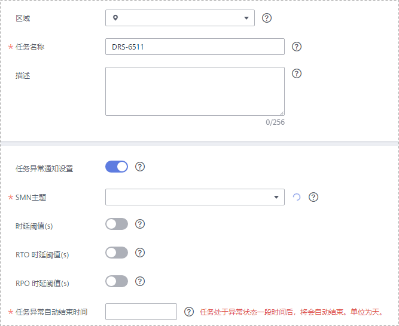
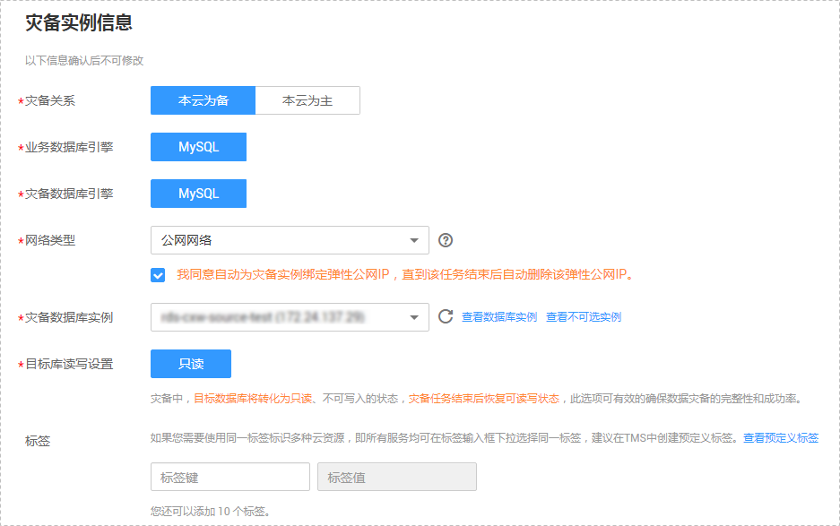
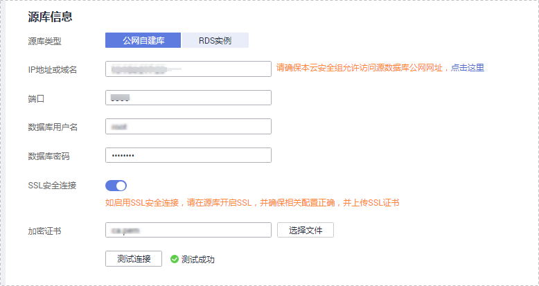
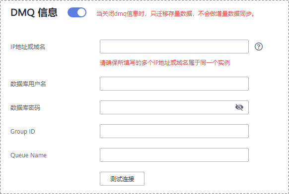
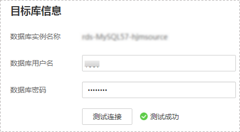
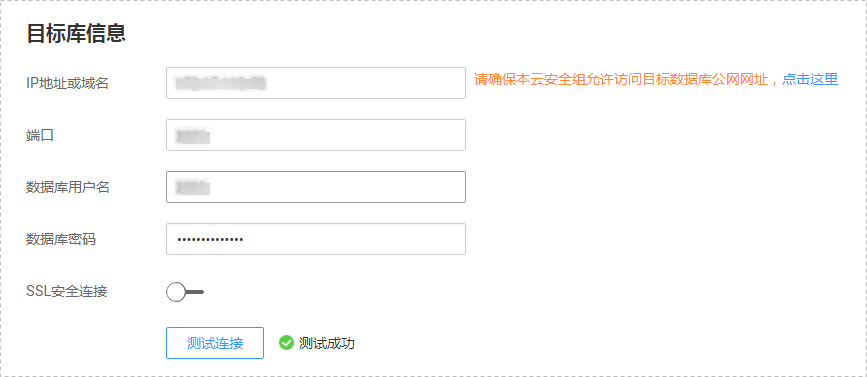
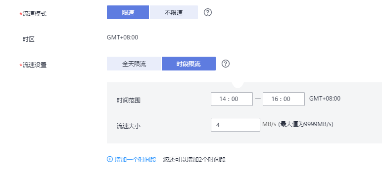

# 步骤一：创建灾备任务

本章节将以MySQL到RDS for MySQL的灾备场景为示例，介绍在公网网络场景下，通过数据复制服务管理控制台配置数据灾备任务的流程，其他存储引擎的配置流程类似。

在数据复制服务中，数据库灾备是通过任务的形式完成的，通过创建任务，可以完成任务信息配置、任务创建。灾备任务创建成功后，您也可以通过数据复制服务管理控制台，对任务进行管理。

## 前提条件

-   已登录数据复制服务控制台。
-   账户余额大于等于0元。
-   满足实时灾备支持的数据库类型，详情请参见[实时灾备](https://support.huaweicloud.com/productdesc-drs/drs_01_0305.html)。
-   满足实时灾备的限制条件，详情请参见[使用须知](使用须知（多活灾备）.md)。

## 操作步骤

1.  在“实时灾备管理“页面，单击“创建灾备任务“，进入创建灾备任务页面。
2.  在“灾备实例”页面，填选区域、任务名称、任务异常通知设置、SMN主题、时延阈值、RTO 时延阈值、RPO 时延阈值、任务异常自动结束时间、描述、灾备实例信息，单击“下一步”。

    **图 1**  灾备任务信息  
    

    **表 1**  任务和描述

    
    <table><thead align="left"><tr id="row55731924204420"><th class="cellrowborder" valign="top" width="23.25%" id="mcps1.2.3.1.1">
<strong id="b1611223511352">参数</strong>

    </th>
    <th class="cellrowborder" valign="top" width="76.75%" id="mcps1.2.3.1.2">
<strong id="b3002268111352">描述</strong>

    </th>
    </tr>
    </thead>
    <tbody><tr id="row86661417103215"><td class="cellrowborder" valign="top" width="23.25%" headers="mcps1.2.3.1.1 ">
区域

    </td>
    <td class="cellrowborder" valign="top" width="76.75%" headers="mcps1.2.3.1.2 ">
当前所在区域，可进行切换。

    </td>
    </tr>
    <tr id="row807311204420"><td class="cellrowborder" valign="top" width="23.25%" headers="mcps1.2.3.1.1 ">
任务名称

    </td>
    <td class="cellrowborder" valign="top" width="76.75%" headers="mcps1.2.3.1.2 ">
任务名称在4-50位之间，必须以字母开头，不区分大小写，可以包含字母、数字、中划线或下划线，不能包含其他的特殊字符。

    </td>
    </tr>
    <tr id="row324483393418"><td class="cellrowborder" valign="top" width="23.25%" headers="mcps1.2.3.1.1 ">
描述

    </td>
    <td class="cellrowborder" valign="top" width="76.75%" headers="mcps1.2.3.1.2 ">
描述不能超过256位，且不能包含! = &lt; &gt; &amp; ' " \ 特殊字符。

    </td>
    </tr>
    <tr id="row1080215433911"><td class="cellrowborder" valign="top" width="23.25%" headers="mcps1.2.3.1.1 ">
任务异常通知设置

    </td>
    <td class="cellrowborder" valign="top" width="76.75%" headers="mcps1.2.3.1.2 ">
该项为可选参数，开启之后，选择对应的SMN主题，。当灾备任务状态异常时，系统将发送通知。

    </td>
    </tr>
    <tr id="row9182135812537"><td class="cellrowborder" valign="top" width="23.25%" headers="mcps1.2.3.1.1 ">
SMN主题

    </td>
    <td class="cellrowborder" valign="top" width="76.75%" headers="mcps1.2.3.1.2 ">
“任务异常通知设置”项开启后可见，需提前在SMN上申请主题并添加订阅。

    
SMN主题申请和订阅可参考<a href="https://support.huaweicloud.com/qs-smn/smn_ug_0004.html" target="_blank" rel="noopener noreferrer">《消息通知服务用户指南》</a>。

    </td>
    </tr>
    <tr id="row157731032102814"><td class="cellrowborder" valign="top" width="23.25%" headers="mcps1.2.3.1.1 ">
时延阈值

    </td>
    <td class="cellrowborder" valign="top" width="76.75%" headers="mcps1.2.3.1.2 ">
在数据灾备阶段，业务数据库和灾备数据库之间的实时同步有时会存在一个时间差，称为时延，单位为秒。

    
时延阈值设置是指时延超过一定的值后（时延阈值范围为1—3600s），DRS可以发送告警通知给指定收件人。告警通知将在时延稳定超过设定的阈值6min后发送，避免出现由于时延波动反复发送告警通知的情况。

    
 说明： 

设置时延阈值之前，需要设置任务异常通知。

    

    </td>
    </tr>
    <tr id="row17435135114288"><td class="cellrowborder" valign="top" width="23.25%" headers="mcps1.2.3.1.1 ">
RTO 时延阈值

    </td>
    <td class="cellrowborder" valign="top" width="76.75%" headers="mcps1.2.3.1.2 ">
RTO时延阈值设置是DRS实例与灾备数据库间同步的时延超过一定的值后（RTO时延阈值范围为1—3600s），DRS可以发送告警通知给指定收件人。告警通知将在时延稳定超过设定的阈值6min后发送，避免出现由于时延波动反复发送告警通知的情况。

    
 说明： 

设置RTO时延阈值之前，需要设置任务异常通知。

    

    </td>
    </tr>
    <tr id="row11722555182816"><td class="cellrowborder" valign="top" width="23.25%" headers="mcps1.2.3.1.1 ">
RPO 时延阈值

    </td>
    <td class="cellrowborder" valign="top" width="76.75%" headers="mcps1.2.3.1.2 ">
RPO时延阈值设置是业务数据库与DRS实例间同步的时延超过一定的值后（RTO时延阈值范围为1—3600s），DRS可以发送告警通知给指定收件人。告警通知将在时延稳定超过设定的阈值6min后发送，避免出现由于时延波动反复发送告警通知的情况。

    
 说明： 
<ul id="ul96298589144"><li>设置RPO时延阈值之前，需要设置任务异常通知。</li><li>初次进入增量灾备阶段，会有较多数据等待同步，产生的较大时延属于正常情况，不在该功能监控范围之内。</li></ul>
    

    </td>
    </tr>
    <tr id="row15606249164412"><td class="cellrowborder" valign="top" width="23.25%" headers="mcps1.2.3.1.1 ">
任务异常自动结束时间（天）

    </td>
    <td class="cellrowborder" valign="top" width="76.75%" headers="mcps1.2.3.1.2 ">
设置任务异常自动结束天数，输入值必须在14-100之间。

    
 说明： 

异常状态下的任务仍然会计费，而长时间异常的任务无法续传和恢复。设置任务异常自动结束天数后，异常且超时的任务将会自动结束，以免产生不必要的费用。

    

    </td>
    </tr>
    </tbody>
    </table>

    **图 2**  灾备实例信息  
    

    **表 2**  灾备实例信息

    
    <table><thead align="left"><tr id="row39932329204436"><th class="cellrowborder" valign="top" width="23.95%" id="mcps1.2.3.1.1">
<strong id="b2587841611355">参数</strong>

    </th>
    <th class="cellrowborder" valign="top" width="76.05%" id="mcps1.2.3.1.2">
<strong id="b1577696211355">描述</strong>

    </th>
    </tr>
    </thead>
    <tbody><tr id="row105088174569"><td class="cellrowborder" valign="top" width="23.95%" headers="mcps1.2.3.1.1 ">
灾备类型

    </td>
    <td class="cellrowborder" valign="top" width="76.05%" headers="mcps1.2.3.1.2 ">
选择“单主灾备”。

    
灾备类型可以为“单主灾备”和“双主灾备”。选择双主灾备时，默认创建两个子任务，分别为正向和反向灾备任务。

    </td>
    </tr>
    <tr id="row138141831164212"><td class="cellrowborder" valign="top" width="23.95%" headers="mcps1.2.3.1.1 ">
灾备关系

    </td>
    <td class="cellrowborder" valign="top" width="76.05%" headers="mcps1.2.3.1.2 ">
选择“本云为备”，灾备类型选择“单主灾备”时该选项可见。

    
灾备关系可以为“本云为备”或者“本云为主”，默认选择“本云为备”。

    
“本云为备”：指灾备数据库为本云数据库的场景。

    
“本云为主”：指业务数据库为本云数据库的场景。

    </td>
    </tr>
    <tr id="row114436415589"><td class="cellrowborder" valign="top" width="23.95%" headers="mcps1.2.3.1.1 ">
本区RDS角色

    </td>
    <td class="cellrowborder" valign="top" width="76.05%" headers="mcps1.2.3.1.2 ">
本云RDS实例在该灾备关系中的角色，分为主1和主2，灾备类型选择“双主灾备”时该选项可见。如何选择请参见<a href="https://support.huaweicloud.com/zh-cn/drs_faq/drs_04_0036.html" target="_blank" rel="noopener noreferrer">如何选择主1、主2</a>。

    <ul id="ul178952028301"><li>主1：创建任务时本云RDS有初始数据。</li><li>主2：创建任务时本云RDS为空实例。</li></ul>
    </td>
    </tr>
    <tr id="row0414184610580"><td class="cellrowborder" valign="top" width="23.95%" headers="mcps1.2.3.1.1 ">
业务数据库引擎

    </td>
    <td class="cellrowborder" valign="top" width="76.05%" headers="mcps1.2.3.1.2 ">
选择MySQL。

    </td>
    </tr>
    <tr id="row42411630204436"><td class="cellrowborder" valign="top" width="23.95%" headers="mcps1.2.3.1.1 ">
灾备数据库引擎

    </td>
    <td class="cellrowborder" valign="top" width="76.05%" headers="mcps1.2.3.1.2 ">
选择MySQL。

    </td>
    </tr>
    <tr id="row62907306204436"><td class="cellrowborder" valign="top" width="23.95%" headers="mcps1.2.3.1.1 ">
网络类型

    </td>
    <td class="cellrowborder" valign="top" width="76.05%" headers="mcps1.2.3.1.2 ">
此处以公网网络为示例。

    
默认为公网网络类型，支持VPN网络、专线网络、公网网络。

    </td>
    </tr>
    <tr id="row658644204515"><td class="cellrowborder" valign="top" width="23.95%" headers="mcps1.2.3.1.1 ">
灾备数据库实例

    </td>
    <td class="cellrowborder" valign="top" width="76.05%" headers="mcps1.2.3.1.2 ">
用户所创建的灾备关系型数据库实例。

    </td>
    </tr>
    <tr id="row549475311111"><td class="cellrowborder" valign="top" width="23.95%" headers="mcps1.2.3.1.1 ">
业务数据库实例

    </td>
    <td class="cellrowborder" valign="top" width="76.05%" headers="mcps1.2.3.1.2 ">
用户所创建的业务关系型数据库实例。灾备关系为“本云为主”时，该选项可见。

    </td>
    </tr>
    <tr id="row31311407145"><td class="cellrowborder" valign="top" width="23.95%" headers="mcps1.2.3.1.1 ">
灾备实例所在子网

    </td>
    <td class="cellrowborder" valign="top" width="76.05%" headers="mcps1.2.3.1.2 ">
请选择灾备实例所在的子网。也可以单击“查看子网”，跳转至“网络控制台”查看实例所在子网帮助选择。

    
默认值为当前所选数据库实例所在子网，请选择有可用IP地址的子网。为确保灾备实例创建成功，仅显示已经开启DHCP的子网。

    </td>
    </tr>
    <tr id="row956511587287"><td class="cellrowborder" valign="top" width="23.95%" headers="mcps1.2.3.1.1 ">
目标库读写设置

    </td>
    <td class="cellrowborder" valign="top" width="76.05%" headers="mcps1.2.3.1.2 ">
只读，灾备类型选择“单主灾备”时该选项可见。

    
单主灾备中，灾备数据库实例将转化为只读、不可写入的状态，通过“灾备监控”界面的“本云数据库升主”功能，可以使灾备数据库（目标库）变为业务数据库，此时数据库将变为读写状态。灾备任务结束/删除后，灾备数据库也将变为读写状态。

    
外部数据库具有superuser权限的账号时，也可以实现作为灾备数据库时只读状态。

    
双主灾备默认将灾备数据库暂时设置为只读状态，当反向任务进入灾备中时，由只读变为可读写状态。

    </td>
    </tr>
    <tr id="row9202214104914"><td class="cellrowborder" valign="top" width="23.95%" headers="mcps1.2.3.1.1 ">
企业项目

    </td>
    <td class="cellrowborder" valign="top" width="76.05%" headers="mcps1.2.3.1.2 ">
对于已成功关联企业项目的用户，仅需在“企业项目”下拉框中选择目标项目。

    
如果需要自定义企业项目，请前往项目管理服务进行创建。关于如何创建项目，详见《项目管理用户指南》。

    </td>
    </tr>
    <tr id="row133503819303"><td class="cellrowborder" valign="top" width="23.95%" headers="mcps1.2.3.1.1 ">
标签

    </td>
    <td class="cellrowborder" valign="top" width="76.05%" headers="mcps1.2.3.1.2 ">
可选配置，对灾备任务的标识。使用标签可方便管理您的灾备任务。每个任务最多支持10个标签配额。

    
任务创建成功后，您可以单击实例名称，在“标签”页签下查看对应标签。关于标签的详细操作，请参见<a href="https://support.huaweicloud.com/usermanual-drs/drs_disaster_tag.html" target="_blank" rel="noopener noreferrer">标签管理</a>。

    </td>
    </tr>
    </tbody>
    </table>

3.  在“源库及目标库”页面，灾备实例创建成功后，填选业务数据库信息和灾备数据库信息后，单击“源库和目标库“处的“测试连接“，分别测试并确定与业务库和灾备库连通后，勾选协议，单击“下一步“。
    -   [步骤2](#li4516889420249)中的“灾备关系“选择“本云为备“。

        **图 3**  本云为备业务数据库信息  
        

        **表 3**  业务数据库信息

        
        <table><thead align="left"><tr id="row7670629142812"><th class="cellrowborder" valign="top" width="23.32%" id="mcps1.2.3.1.1">
<strong id="b106702298285">参数</strong>

        </th>
        <th class="cellrowborder" valign="top" width="76.68%" id="mcps1.2.3.1.2">
<strong id="b166701829122819">描述</strong>

        </th>
        </tr>
        </thead>
        <tbody><tr id="row7672152917285"><td class="cellrowborder" valign="top" width="23.32%" headers="mcps1.2.3.1.1 ">
源库类型

        </td>
        <td class="cellrowborder" valign="top" width="76.68%" headers="mcps1.2.3.1.2 ">
默认选择“自建库”。

        
源库类型可以为“自建库”，或“RDS实例”。选择“RDS实例”后，需要选择“区域”，该区域为源库所在区域，不能与目标库区域相同，目标库所在区域为控制台当前登录区域。“RDS实例”功能需要提交工单申请才能使用。您可以在管理控制台右上角，选择“工单 &gt; 新建工单”，完成工单提交。

        </td>
        </tr>
        <tr id="row15672132917287"><td class="cellrowborder" valign="top" width="23.32%" headers="mcps1.2.3.1.1 ">
IP地址或域名

        </td>
        <td class="cellrowborder" valign="top" width="76.68%" headers="mcps1.2.3.1.2 ">
业务数据库的IP地址或域名。

        </td>
        </tr>
        <tr id="row1867252913285"><td class="cellrowborder" valign="top" width="23.32%" headers="mcps1.2.3.1.1 ">
端口

        </td>
        <td class="cellrowborder" valign="top" width="76.68%" headers="mcps1.2.3.1.2 ">
业务数据库服务端口，可输入范围为1~65535间的整数。

        </td>
        </tr>
        <tr id="row1467372962815"><td class="cellrowborder" valign="top" width="23.32%" headers="mcps1.2.3.1.1 ">
数据库用户名

        </td>
        <td class="cellrowborder" valign="top" width="76.68%" headers="mcps1.2.3.1.2 ">
业务数据库的用户名。

        </td>
        </tr>
        <tr id="row176731929192817"><td class="cellrowborder" valign="top" width="23.32%" headers="mcps1.2.3.1.1 ">
数据库密码

        </td>
        <td class="cellrowborder" valign="top" width="76.68%" headers="mcps1.2.3.1.2 ">
业务数据库的用户名所对应的密码。支持在任务创建后修改密码。

        
任务为启动中、初始化、灾备中、灾备异常状态时，可在“基本信息”页面的“灾备信息”区域，单击“源库密码”后的“替换密码”，在弹出的对话框中修改密码。

        </td>
        </tr>
        <tr id="row1567382972814"><td class="cellrowborder" valign="top" width="23.32%" headers="mcps1.2.3.1.1 ">
SSL安全连接

        </td>
        <td class="cellrowborder" valign="top" width="76.68%" headers="mcps1.2.3.1.2 ">
通过该功能，用户可以选择是否开启对迁移链路的加密。如果开启该功能，需要用户上传SSL CA根证书。

        
 说明： 
<ul id="ul367313297289"><li>最大支持上传500KB的证书文件。</li><li>如果不使用SSL证书，请自行承担数据安全风险。</li></ul>
        

        </td>
        </tr>
        <tr id="row8673202914289"><td class="cellrowborder" valign="top" width="23.32%" headers="mcps1.2.3.1.1 ">
区域

        </td>
        <td class="cellrowborder" valign="top" width="76.68%" headers="mcps1.2.3.1.2 ">
业务数据库RDS实例所在区域，不支持选择本区域。源库类型可以为“RDS实例”时，该选项可见。

        </td>
        </tr>
        <tr id="row9674102914289"><td class="cellrowborder" valign="top" width="23.32%" headers="mcps1.2.3.1.1 ">
数据库实例名称

        </td>
        <td class="cellrowborder" valign="top" width="76.68%" headers="mcps1.2.3.1.2 ">
业务数据库实例名称。源库类型可以为“RDS实例”时，该选项可见。

        </td>
        </tr>
        <tr id="row10585952429"><td class="cellrowborder" valign="top" width="23.32%" headers="mcps1.2.3.1.1 ">
是否NAT网络

        </td>
        <td class="cellrowborder" valign="top" width="76.68%" headers="mcps1.2.3.1.2 ">
是否为VPC-NAT网络。源库类型可以为“RDS实例”时，该选项可见。

        </td>
        </tr>
        <tr id="row6843143610217"><td class="cellrowborder" valign="top" width="23.32%" headers="mcps1.2.3.1.1 ">
映射IP

        </td>
        <td class="cellrowborder" valign="top" width="76.68%" headers="mcps1.2.3.1.2 ">
如果为VPC-NAT网络，填写映射后的IP。源库类型可以为“RDS实例”时，该选项可见。

        </td>
        </tr>
        <tr id="row1267442992811"><td class="cellrowborder" valign="top" width="23.32%" headers="mcps1.2.3.1.1 ">
数据库用户名

        </td>
        <td class="cellrowborder" valign="top" width="76.68%" headers="mcps1.2.3.1.2 ">
业务数据库用户名称。

        </td>
        </tr>
        <tr id="row186749299286"><td class="cellrowborder" valign="top" width="23.32%" headers="mcps1.2.3.1.1 ">
数据库密码

        </td>
        <td class="cellrowborder" valign="top" width="76.68%" headers="mcps1.2.3.1.2 ">
业务数据库的数据库用户密码。

        </td>
        </tr>
        </tbody>
        </table>

        > **说明：** 
        >-   业务数据库的IP地址或域名、数据库用户名和密码，会被系统加密暂存，直至删除该迁移任务后自动清除。

        **图 4**  DMQ信息  
        

        **表 4**  DMQ信息

        
        <table><thead align="left"><tr id="row195391553115710"><th class="cellrowborder" valign="top" width="23%" id="mcps1.2.3.1.1">
<strong id="b853945312577">参数</strong>

        </th>
        <th class="cellrowborder" valign="top" width="77%" id="mcps1.2.3.1.2">
<strong id="b175391353185718">描述</strong>

        </th>
        </tr>
        </thead>
        <tbody><tr id="row1753985316572"><td class="cellrowborder" valign="top" width="23%" headers="mcps1.2.3.1.1 ">
IP地址或域名

        </td>
        <td class="cellrowborder" valign="top" width="77%" headers="mcps1.2.3.1.2 ">
DMQ服务的IP地址或域名。最多支持填写10个IP地址或域名，多个值之间请用英文逗号隔开。例如192.168.0.1:8080,192.168.0.2:8080

        </td>
        </tr>
        <tr id="row954085345711"><td class="cellrowborder" valign="top" width="23%" headers="mcps1.2.3.1.1 ">
数据库用户名

        </td>
        <td class="cellrowborder" valign="top" width="77%" headers="mcps1.2.3.1.2 ">
DMQ服务的用户名。

        </td>
        </tr>
        <tr id="row1211712221582"><td class="cellrowborder" valign="top" width="23%" headers="mcps1.2.3.1.1 ">
数据库密码

        </td>
        <td class="cellrowborder" valign="top" width="77%" headers="mcps1.2.3.1.2 ">
DMQ服务的密码。

        </td>
        </tr>
        <tr id="row16486819175820"><td class="cellrowborder" valign="top" width="23%" headers="mcps1.2.3.1.1 ">
Group ID

        </td>
        <td class="cellrowborder" valign="top" width="77%" headers="mcps1.2.3.1.2 ">
DMQ服务消息接收方（Consumer）的分组，会根据Consumer的分组来决定消息如何分发和记录分组对应的位置。

        </td>
        </tr>
        <tr id="row1960431616583"><td class="cellrowborder" valign="top" width="23%" headers="mcps1.2.3.1.1 ">
Queue Name

        </td>
        <td class="cellrowborder" valign="top" width="77%" headers="mcps1.2.3.1.2 ">
DMQ服务的消息类别。

        </td>
        </tr>
        </tbody>
        </table>

        **图 5**  本云为备灾备数据库信息  
        

        **表 5**  灾备数据库信息

        
        <table><thead align="left"><tr id="row1067713293282"><th class="cellrowborder" valign="top" width="23%" id="mcps1.2.3.1.1">
<strong id="b1267612922811">参数</strong>

        </th>
        <th class="cellrowborder" valign="top" width="77%" id="mcps1.2.3.1.2">
<strong id="b96771929192815">描述</strong>

        </th>
        </tr>
        </thead>
        <tbody><tr id="row367742910282"><td class="cellrowborder" valign="top" width="23%" headers="mcps1.2.3.1.1 ">
数据库实例名称

        </td>
        <td class="cellrowborder" valign="top" width="77%" headers="mcps1.2.3.1.2 ">
默认为创建灾备任务时选择的数据库实例，不可进行修改。

        </td>
        </tr>
        <tr id="row126771429162815"><td class="cellrowborder" valign="top" width="23%" headers="mcps1.2.3.1.1 ">
数据库用户名

        </td>
        <td class="cellrowborder" valign="top" width="77%" headers="mcps1.2.3.1.2 ">
灾备数据库对应的数据库用户名。

        </td>
        </tr>
        <tr id="row4677029112816"><td class="cellrowborder" valign="top" width="23%" headers="mcps1.2.3.1.1 ">
数据库密码

        </td>
        <td class="cellrowborder" valign="top" width="77%" headers="mcps1.2.3.1.2 ">
灾备数据库对应的用户名密码。支持在任务创建后修改密码。

        
任务为启动中、初始化、灾备中、灾备异常状态时，可在“基本信息”页面的“灾备信息”区域，单击“目标库密码”后的“替换密码”，在弹出的对话框中修改密码。

        
数据库用户名和密码将被系统加密暂存，直至该任务删除后清除。

        </td>
        </tr>
        </tbody>
        </table>

    -   [步骤2](#li4516889420249)中的“灾备关系“选择“本云为主“。

        **图 6**  本云为主业务数据库信息  
        

        **表 6**  业务数据库信息

        
        <table><thead align="left"><tr id="row56782029182818"><th class="cellrowborder" valign="top" width="23%" id="mcps1.2.3.1.1">
<strong id="b867812299287">参数</strong>

        </th>
        <th class="cellrowborder" valign="top" width="77%" id="mcps1.2.3.1.2">
<strong id="b6678529132819">描述</strong>

        </th>
        </tr>
        </thead>
        <tbody><tr id="row156781329152817"><td class="cellrowborder" valign="top" width="23%" headers="mcps1.2.3.1.1 ">
数据库实例名称

        </td>
        <td class="cellrowborder" valign="top" width="77%" headers="mcps1.2.3.1.2 ">
默认为创建灾备任务时选择的数据库实例，不可进行修改。

        </td>
        </tr>
        <tr id="row116781629192812"><td class="cellrowborder" valign="top" width="23%" headers="mcps1.2.3.1.1 ">
数据库用户名

        </td>
        <td class="cellrowborder" valign="top" width="77%" headers="mcps1.2.3.1.2 ">
业务数据库对应的数据库用户名。

        </td>
        </tr>
        <tr id="row1867892972816"><td class="cellrowborder" valign="top" width="23%" headers="mcps1.2.3.1.1 ">
数据库密码

        </td>
        <td class="cellrowborder" valign="top" width="77%" headers="mcps1.2.3.1.2 ">
业务数据库对应的用户名密码。支持在任务创建后修改密码。

        
任务为启动中、初始化、灾备中、灾备异常状态时，可在“基本信息”页面的“灾备信息”区域，单击“源库密码”后的“替换密码”，在弹出的对话框中修改密码。

        
数据库用户名和密码将被系统加密暂存，直至该任务删除后清除。

        </td>
        </tr>
        </tbody>
        </table>

        **图 7**  本云为主灾备数据库信息  
        

        **表 7**  灾备数据库信息

        
        <table><thead align="left"><tr id="row12679102915283"><th class="cellrowborder" valign="top" width="23.32%" id="mcps1.2.3.1.1">
<strong id="b367992911284">参数</strong>

        </th>
        <th class="cellrowborder" valign="top" width="76.68%" id="mcps1.2.3.1.2">
<strong id="b3679142912812">描述</strong>

        </th>
        </tr>
        </thead>
        <tbody><tr id="row067922912817"><td class="cellrowborder" valign="top" width="23.32%" headers="mcps1.2.3.1.1 ">
IP地址或域名

        </td>
        <td class="cellrowborder" valign="top" width="76.68%" headers="mcps1.2.3.1.2 ">
业务数据库的IP地址或域名。

        </td>
        </tr>
        <tr id="row1567982912285"><td class="cellrowborder" valign="top" width="23.32%" headers="mcps1.2.3.1.1 ">
端口

        </td>
        <td class="cellrowborder" valign="top" width="76.68%" headers="mcps1.2.3.1.2 ">
业务数据库服务端口，可输入范围为1~65535间的整数。

        </td>
        </tr>
        <tr id="row86791629122812"><td class="cellrowborder" valign="top" width="23.32%" headers="mcps1.2.3.1.1 ">
数据库用户名

        </td>
        <td class="cellrowborder" valign="top" width="76.68%" headers="mcps1.2.3.1.2 ">
业务数据库的用户名。

        </td>
        </tr>
        <tr id="row1067910294285"><td class="cellrowborder" valign="top" width="23.32%" headers="mcps1.2.3.1.1 ">
数据库密码

        </td>
        <td class="cellrowborder" valign="top" width="76.68%" headers="mcps1.2.3.1.2 ">
业务数据库的用户名所对应的密码。支持在任务创建后修改密码。

        
任务为启动中、初始化、灾备中、灾备异常状态时，可在“基本信息”页面的“灾备信息”区域，单击“目标库密码”后的“替换密码”，在弹出的对话框中修改密码。

        </td>
        </tr>
        <tr id="row9680172922819"><td class="cellrowborder" valign="top" width="23.32%" headers="mcps1.2.3.1.1 ">
SSL安全连接

        </td>
        <td class="cellrowborder" valign="top" width="76.68%" headers="mcps1.2.3.1.2 ">
通过该功能，用户可以选择是否开启对迁移链路的加密。如果开启该功能，需要用户上传SSL CA根证书。

        
 说明： 

最大支持上传500KB的证书文件。

        

        </td>
        </tr>
        </tbody>
        </table>

        > **说明：** 
        >**灾备数据库的IP地址或域名、数据库用户名和密码，会被系统加密暂存，直至删除该迁移任务后自动清除。**

4.  在“灾备设置“页面，设置流速模式，单击“下一步“。

    
    <table><thead align="left"><tr id="zh-cn_topic_0078078071_row165921632141911"><th class="cellrowborder" valign="top" width="16.1%" id="mcps1.1.3.1.1">
<strong id="zh-cn_topic_0078078071_b1783318515228">参数</strong>

    </th>
    <th class="cellrowborder" valign="top" width="83.89999999999999%" id="mcps1.1.3.1.2">
<strong id="zh-cn_topic_0078078071_b10555114922418">描述</strong>

    </th>
    </tr>
    </thead>
    <tbody><tr id="zh-cn_topic_0078078071_row374511379492"><td class="cellrowborder" valign="top" width="16.1%" headers="mcps1.1.3.1.1 ">
流速模式

    
 说明： 

目前仅MySQL-&gt;MySQL、MySQL-&gt;GaussDB(for MySQL)的实时灾备支持该功能。

    

    </td>
    <td class="cellrowborder" valign="top" width="83.89999999999999%" headers="mcps1.1.3.1.2 ">
流速模式支持限速和不限速，默认为不限速。

    <ul id="zh-cn_topic_0135097933_zh-cn_topic_0078078071_ul9762123112510"><li>限速
自定义的最大灾备速度，灾备过程中的速度将不会超过该速度。

    
当流速模式选择了“限速”时，你需要通过流速设置来定时控制灾备速度。流速设置通常包括限速时间段和流速大小的设置。默认的限速时间段为全天限流，您也可以根据业务需求自定义时段限流。自定义的时段限流支持最多设置3个定时任务，每个定时任务之间不能存在交叉的时间段，未设定在限速时间段的时间默认为不限速。

    
流速的大小需要根据业务场景来设置，不能超过9999MB/s。

    
<b>图1 </b>灾备设置流速模式 

    </li><li>不限速
对灾备速度不进行限制，通常会最大化使用源数据库的出口带宽。该流速模式同时会对源数据库造成读消耗，消耗取决于源数据库的出口带宽。比如源数据库的出口带宽为100MB/s，假设高速模式使用了80%带宽，则灾备对源数据库将造成80MB/s的读操作IO消耗。
 说明： 
<ul id="zh-cn_topic_0135097933_ul1933411217553"><li>限速模式只对初始化迁移阶段生效，灾备中阶段不生效。</li><li>您也可以在任务为“配置”状态时修改流速模式。操作方法为：在“基本信息”页签的“灾备信息”区域，单击“流速模式”后的“修改”，在弹出的对话框中修改流速模式。“启动中”的任务不支持修改流速模式。</li></ul>
    

    

    </li></ul>
    </td>
    </tr>
    </tbody>
    </table>

5.  在“预检查“页面，进行灾备任务预校验，校验通过后才可进行下一步。
    -   查看检查结果，如有不通过的检查项，需要修复不通过项后，单击“重新校验”重新进行灾备任务的预检查。

        预检查不通过项处理建议请参见《数据复制服务用户指南》中的“[预检查不通过项修复方法](https://support.huaweicloud.com/usermanual-drs/drs_precheck.html)”。

        **图 9**  灾备预检查  
        

    -   预检查完成后，且预检查通过率为100%时，单击“下一步”，进入“参数对比“页面。

        > **说明：** 
        >所有检查项结果均通过时，若存在请确认项，需要阅读并确认详情后才可以继续执行下一步操作。

6.  在“参数对比“页面，进行参数对比。

    参数对比功能从“常规参数“和“性能参数“两个维度，展示了业务数据库和灾备数据库参数值的一致性情况。您可以根据业务需要，决定是否选用该功能。该操作不影响数据灾备，主要目的是为了确保数据灾备成功后业务应用的使用不受影响。

    -   若您选择不进行参数对比，可跳过该步骤，单击页面右下角“下一步“按钮，继续执行后续操作。
    -   若您选择进行参数对比，请参照如下的步骤操作。
        -   对于常规参数，一般情况下，如果业务数据库和灾备数据库存在不一致的情况，建议单击“一键修改“，将灾备数据库参数修改为和业务数据库对应参数相同的值。

            **图 10**  灾备修改常规参数  
            

        -   对于性能参数，您可以根据业务场景，自定义业务数据库和灾备数据库的参数值，二者结果可以一致也可以不一致。
            -   将对比结果一致的性能参数修改为不一致：在“目标库值调整为“一列手动输入结果后，单击左上角的“一键修改“，即可完成修改。
            -   将对比结果不一致的性能参数改为一致，请参考如下流程进行修改：
                1.  对业务库和灾备库的参数值。

                    选择需要修改的参数后，单击“一键对齐“，系统将帮您自动填充灾备数据库的参数值，使其和业务数据库对应的参数值保持一致。

                    **图 11**  灾备一键对齐参数  
                    

                    > **说明：** 
                    >您也可以通过手动输入结果，对齐参数值。

                2.  修改参数值。

                    业务数据库和灾备数据库的不一致参数值对齐后，单击“一键修改“，系统将按照您当前设置的灾备数据库参数值进行修改。修改完成后，灾备数据库的参数值和对比结果会自动更新。

                    部分参数修改后无法在灾备数据库立即生效，需要重启才能生效，此时的对比结果显示为“待重启，不一致”。建议您在灾备任务启动之前重启灾备标数据库，或者数据灾备结束后选择一个计划时间重启。如果您选择数据灾备结束后重启灾备数据库，请合理设置重启计划时间，避免参数生效太晚影响业务的正常使用。

                    在进行参数对比功能时，您可以参见《数据复制服务用户指南》中“[参数对比列表](https://support.huaweicloud.com/usermanual-drs/drs_08_0001.html)”进行参数设置。

                3.  参数对比操作完成后，单击“下一步”，进入“任务确认“页面。

7.  在“任务确认“页面，设置灾备任务的启动时间，并确认灾备任务信息无误后，单击“启动任务“，提交灾备任务。

    灾备任务的启动时间可以根据业务需求，设置为“立即启动”或“稍后启动”。

    预计灾备任务启动后，会对业务数据库和灾备数据库的性能产生影响，建议选择业务低峰期，合理设置灾备任务的启动时间。

8.  灾备任务提交后，您可在“实时灾备管理“页面，查看并管理自己的任务。
    -   您可查看任务提交后的状态，状态请参见[参考：任务状态含义](任务状态(实时灾备).md)。
    -   在任务列表的右上角，单击刷新列表，可查看到最新的任务状态。

