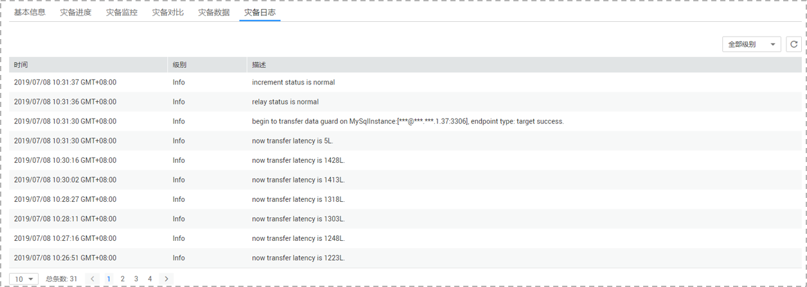

# 步骤三：查看灾备日志

灾备日志记录了数据灾备同步过程中的信息，包含告警、错误和提示等类型的信息。数据灾备过程中，可以通过查看灾备日志信息，帮助您分析系统中存在的问题。

## 前提条件

已登录数据复制服务控制台。

## 操作步骤

1.  在“多活灾备管理“界面，选中指定灾备任务，单击任务名称。
2.  在“灾备日志“页签，查看当前灾备任务的日志。

    **图 1**  查看灾备日志  
    

