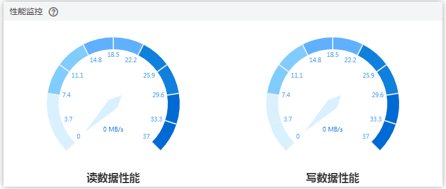

# 步骤二：查询迁移进度

迁移进度展示了迁移过程中，实时迁移任务的表迁移进度，可以帮助您了解迁移完成的情况。

DRS提供流式进度展示，帮助您在迁移过程中实时了解迁移进展。全量迁移过程中，展示迁移进度总览和迁移明细。

-   进度总览中，您可以查看结构、数据、索引迁移的进度，当显示为100%时，表示该项迁移完成。过程中，数据和索引的迁移相对较慢。
-   迁移明细中，您可以查看具体迁移对象的迁移进度，当“对象数目“和“已迁移数目“相等时，表示该对象已经迁移完成，可通过“查看详情“查看每个对象的迁移进度。增量迁移中，“进度明细“将不再显示，您可以使用“迁移对比“页签查看一致性情况。

> **说明：** 
>-   目前仅MySQL到MySQL迁移的白名单用户该支持查看迁移明细，需要提交工单申请才能使用。您可以在管理控制台右上角，选择“工单 \> 新建工单”，完成工单提交。
>-   在任务未结束前，不能修改源库和目标库的所有用户、密码和用户权限等。
>-   全量、增量完成不代表任务结束，如果存在触发器和事件将会进行迁移。

## 前提条件

-   已登录数据复制服务控制台。
-   已启动迁移任务。

## 操作步骤

1.  在“实时迁移管理“界面，选中指定迁移任务，单击任务名称，进入“基本信息”页面。
2.  单击“迁移进度“页签，查看迁移进度。
    -   查看结构、数据、索引的迁移的百分比进度。

        “全量迁移“模式：当全量迁移完成时，显示全量迁移各项指标完成进度100%。

        “全量+增量”迁移模式：全量迁移完成后，开始进行增量迁移可，在“迁移进度”页签下，查看增量迁移同步时延。

        **图 1**  迁移进度总览  
        

        增量迁移时延也可在“实时迁移管理“界面查看，当增量时延超过用户设置或系统默认的时延阈值时，任务管理界面增量时延显示为红色。

        > **说明：** 
        >时延 = 源库当前系统时间 - 成功同步到目标库的最新一个事务在源库的提交成功时间。
        >一个事务同步的完整过程如下：
        >1.  源端数据库的抽取；
        >2.  经过网络的传输；
        >3.  由DRS进行日志解析；
        >4.  最终在目标数据库上的执行完成。
        >这样完成了事务从源到目标的同步，时延为该事务最后在目标数据库上执行完成时的源库当前系统时间（current\_time）与该事务在源库的提交成功时间（committed\_time）的时间差，时延为0代表源和目标瞬时一致，无新的事务需要同步。

        > **注意：** 
        >长时间未提交事务和频繁DDL操作均可以造成高时延。

    -   查看迁移对象的进度。在“进度明细“下，单击目标迁移对象“详细信息“列的“查看详情“，查看对象的迁移进度，进入增量迁移后，该数据将不再显示，您可以使用“迁移对比“页签，进行一致性对比。

        **图 2**  迁移进度明细  
        

    -   查看读写数据性能。单击“监控图表“查看读写数据性能，该图表展示了实时读取源库和写入目标库数据的速率，其单位为MB/s。

        **图 3**  性能监控  
        

