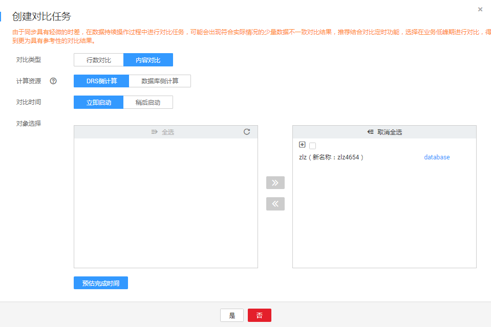

# 步骤四：对比同步项

对比数据同步项可以清晰反馈出源数据库和目标数据库的数据是否存在差异。为了尽可能减少业务的影响和业务中断时间，数据同步场景提供了对象级对比和数据级对比功能，帮助您确定合适的业务割接时机。

-   对象级对比：支持对数据库、索引、表等对象进行对比。
-   数据级对比：支持对表的行数和内容进行对比。

## 前提条件

已登录数据复制服务控制台。

## 操作步骤

1.  在“数据同步管理“界面，选中指定同步任务，单击任务名称，进入“基本信息”页签。
2.  单击“同步对比“页签，进入“同步对比”信息页面。
3.  单击“对象级对比”，观察源数据库和目标数据库的各个对比项结果是否一致。若需要查看结果详情，可单击指定对比项操作列的“详情”按钮。

    **图 1**  同步对象对比  
    

4.  确认对象级对比无缺失后，单击“数据级对比”页签。
5.  单击“创建对比任务”，选择“对比类型”、“计算资源”、“对比时间”和“对象选择”，单击“是”提交对比任务。

    **图 2**  创建对比任务  
    

    -   对比类型：分为行数对比和内容对比。
    -   计算资源：该功能会影响内容对比运算对源数据库资源占用度。其中计算资源分为DRS侧计算和数据库侧计算两种。
        -   DRS侧计算：DRS先将数据从源数据库读取到DRS实例上，再与目标数据库的内容对比，该操作会造成源IO读负载上升，但内容对比对源CPU和内存的性能无影响，适用于业务期间对冷数据的静态表进行内容对比。
        -   数据库侧计算：直接使用源和目标的CPU、内存、IO资源进行对比，适用于无数据变化的非业务时间窗口进行内容对比，对比速度通常快于DRS侧对比。

    -   对比时间：可设置为“立即启动“和“稍后启动“。由于同步具有轻微的时差，在数据持续操作过程中进行对比任务，可能会出现符合实际情况的少量数据不一致对比结果，推荐结合对比定时功能，选择在业务低峰期进行对比，得到更为具有参考性的对比结果。
    -   对象选择：可根据具体的业务场景选择需要进行对比的对象。

    > **说明：**   
    >-   目前仅MySQL到MySQL的数据同步场景支持内容对比。  
    >-   全量同步中的任务无法进行数据级对比。  
    >-   目前仅MySQL引擎支持计算资源选择。  

6.  对比任务提交成功后，返回“数据级对比”页签，单击刷新列表，可以查看到所选对比类型的对比结果。

    **图 3**  同步数据对比  
    

    由于内容对比功能目前只支持带有单字段主键或单字段唯一索引的表，不支持内容对比的表可以使用行数对比功能。所以数据级对比功能需要结合业务场景，选用行数对比或者内容对比。

    若需要查看行数对比或者内容对比详情，可单击指定对比类型操作列的“查看对比报表”，页面将跳转至新的窗口，可观察对比结果的详细情况。

    **图 4**  数据级对比详情  
    

    > **说明：**   
    >已取消的对比任务也支持查看对比报表。  

