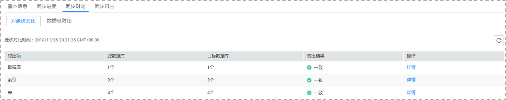
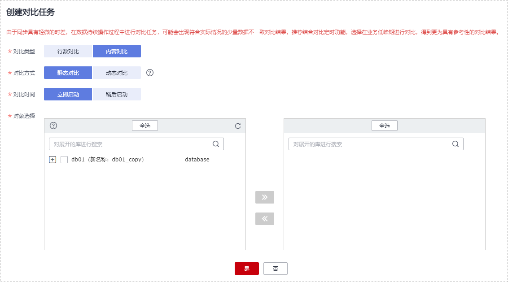
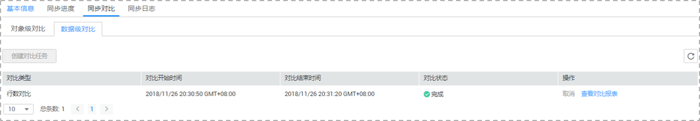
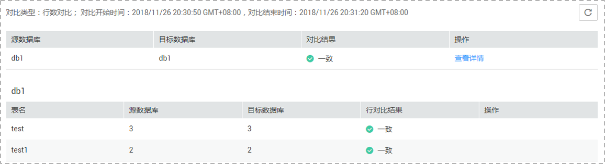

# 步骤四：对比同步项

对比实时同步项可以清晰反馈出源数据库和目标数据库的数据是否存在差异。为了尽可能减少业务的影响和业务中断时间，实时同步场景提供了对象级对比和数据级对比功能，帮助您确定合适的业务割接时机。

-   对象级对比：支持对数据库、索引、表、视图、表的排序规则等对象进行对比。
-   数据级对比：支持对表的行数和内容进行对比。

    > **说明：** 
    >-   全量同步中的任务无法进行数据级对比。
    >-   如果单独对目标库进行数据修改操作，有可能数据检验不准确。
    >-   行对比的多对一场景，是将源库中的表与映射到目标库中的聚合表中对应的那部分数据做行数比对。
    >-   部分数据类型不支持内容对比，详情参考[内容对比不支持哪些数据类型](https://support.huaweicloud.com/drs_faq/drs_16_1130.html)。

-   用户对比：对源库和目标库的账号名称、权限进行对比。

    > **说明：** 
    >实时同步目前仅PostgreSQL-\>PostgreSQL同步支持用户对比。

## 前提条件

已登录数据复制服务控制台。

## 操作步骤

1.  在“实时同步管理“界面，选中指定同步任务，单击任务名称，进入“基本信息”页签。
2.  单击“同步对比“页签，进入“同步对比”信息页面。
3.  对比同步项。
    -   创建对象级对比：选择“对象级对比”页签，单击“开始对比“后稍等一段时间再单击，观察源数据库和目标数据库的各个对比项结果是否一致。若需要查看结果详情，可单击指定对比项操作列的“详情”按钮。

        **图 1**  同步对象对比  
        

    -   创建数据级对比：选择“数据级对比”页签，单击“创建对比任务”，选择“对比类型”、“对比方式”、“对比时间”和“对象选择”，单击“是”提交对比任务。

        **图 2**  创建数据对比任务  
        

        -   对比类型：分为行数对比和内容对比。
            -   行数对比：用于对比源和目标端的表的行数是否相等。

                > **说明：** 
                >-   任务进入增量阶段后，用户可以创建行对比任务。
                >-   Oracle-\>GaussDB\(for openGauss\)同步任务，当全量任务结束的时候会自动触发行对比任务。

            -   内容对比：用于对比源和目标端的表的数据是否一致。

                > **说明：** 
                >-   任务进入增量阶段后，用户可以创建内容对比任务。全量同步完成后，源库数据不能发生变更，否则内容对比结果会不一致。
                >-   Oracle-\>GaussDB\(for openGauss\)分布式进入增量校验状态后，对比服务会开始通过解析的该任务涉及的表的增量日志抽取数据，持续对比。如果用户想要对比其他表的迁移状态，可以取消正在对比的任务，创建新的对比任务。

                由于内容对比功能目前只支持带有单字段主键或单字段唯一索引的表，不支持内容对比的表可以使用行数对比功能。所以数据级对比功能需要结合业务场景，选用行数对比或者内容对比。

        -   对比策略：分为普通对比和多对一对比两种。
            -   普通比对策略：源库中的一张表跟映射到目标库中的那张表做整表的行数比对。
            -   多对一比对策略：源库中的一张表跟映射到目标库中的聚合表中对应的那部分数据做行数比对。

                > **说明：** 
                >对比类型为行数对比时，支持对比策略选择。

        -   对比方式：分为静态对比和动态对比两种。
            -   静态对比：对源数据库和目标数据库进行一次全量内容对比，内容对比完成后对比任务结束，适用于无数据变化的非业务时间。
            -   动态对比：先对源数据库和目标数据库进行一次全量内容对比，对比任务完成后进入增量对比阶段，实时比对源数据库和目标数据库的增量数据，适用于有数据变化的业务时间。

                > **说明：** 
                >-   目前仅部分引擎支持对比方式选择。
                >-   对比类型为内容对比时，支持对比方式的选择。

        -   对比时间：可设置为“立即启动“和“稍后启动“。由于同步具有轻微的时差，在数据持续操作过程中进行对比任务，可能会出现符合实际情况的少量数据不一致对比结果，推荐结合对比定时功能，选择在业务低峰期进行对比，得到更为具有参考性的对比结果。
        -   对象选择：可根据具体的业务场景选择需要进行对比的对象。

    -   用户对比：单击“用户对比“页签，可查看数据库账号及权限的对比结果。

        **图 3**  同步用户对比  
        

        > **说明：** 
        >-   全量同步中的任务无法进行用户对比。
        >-   实时同步目前仅PostgreSQL-\>PostgreSQL的同步支持用户对比。

4.  对比任务提交成功后，返回“数据级对比”页签，单击刷新列表，可以查看到所选对比类型的对比结果。

    **图 4**  同步数据对比  
    

    由于内容对比功能目前只支持带有单字段主键或单字段唯一索引的表，不支持内容对比的表可以使用行数对比功能。所以数据级对比功能需要结合业务场景，选用行数对比或者内容对比。

    若需要查看行数对比或者内容对比详情，可单击指定对比类型操作列的“查看对比报表”，页面将跳转至新的窗口，可观察对比结果的详细情况。

    若需要下载行数对比或者内容对比结果，可单击指定对比类型操作列的“导出报告”。

    **图 5**  数据级对比详情  
    

    > **说明：** 
    >已取消的对比任务也支持查看对比报表。

