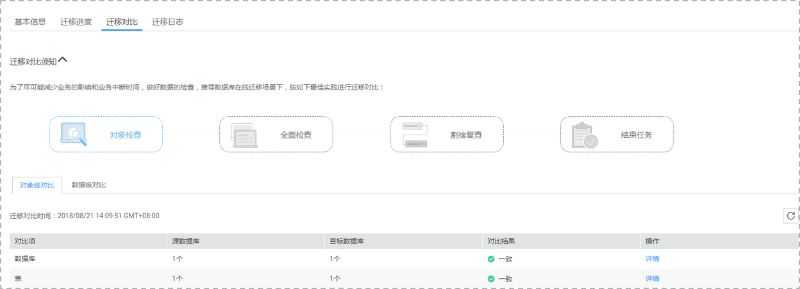
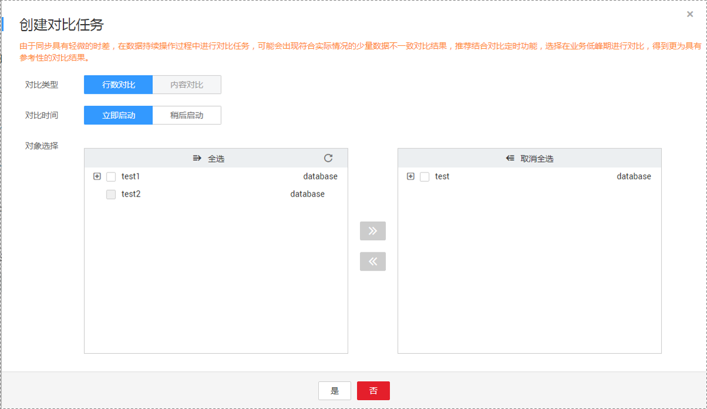
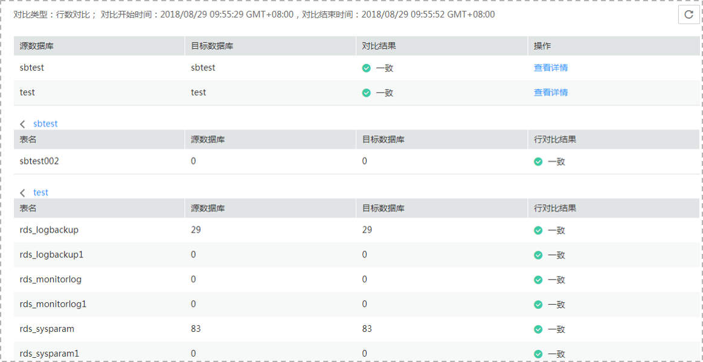

# 步骤四：对比灾备项

对比灾备项可以对比业务数据库和灾备数据库的数据一致性。灾备对比功能支持对象级对比和数据级对比。

-   对象级对比：支持对数据库、索引、表、视图、存储过程和函数等对象进行对比。
-   数据级对比：支持对表的行数和内容进行对比。为了确保对比结果具有可参考性，请通过“稍后启动“功能在业务低峰期或者无业务期进行数据对比，业务运行期间由于数据的持续变化，仅适合对一些业务的低频率修改的冷数据进行对比。

## 前提条件

已登录数据复制服务控制台。

## 操作步骤

1.  在“多活灾备管理“界面，选中指定灾备任务，单击任务名称，进入“基本信息”页签。
2.  单击“灾备对比“页签，进入“灾备对比”信息页面，对业务数据库和灾备数据库的数据进行对比分析。
    1.  首先进行数据库对象完整性检查。

        单击“对象检查”，进入“对象级对比”页签，查看各个对比项的对比结果。

        **图 1**  对象级对比  
        

        若需要查看对比项的对比结果详情，可单击指定对比项操作列的“详情”。

    2.  数据库对象检查完成后，进行灾备数据行数对比。

        单击灾备对比须知处的“全面检查”，进入创建对比任务页面，选择“对比类型”、“对比时间”和“对象选择”，单击“确定”，提交对比任务。

        **图 2**  创建对比任务  
        

        > **说明：**   
        >-   初始化中的任务无法进行数据级对比。  

        对比任务提交成功后，返回“数据级对比”页签，单击刷新列表，可以查看到所选对比类型的对比结果。

        若需要查看对比类型详情，可单击指定对比类型操作列的“查看对比报表”，然后选择需要进行对比的数据库，单击操作列的“查看详情”，查看指定业务数据库和灾备数据库的对比结果详情。

        **图 3**  对比详情  
        

        > **说明：**   
        >已取消的对比任务也支持查看对比报表。  

