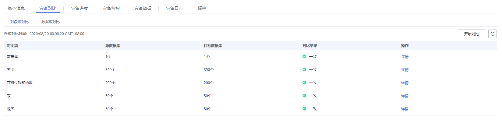
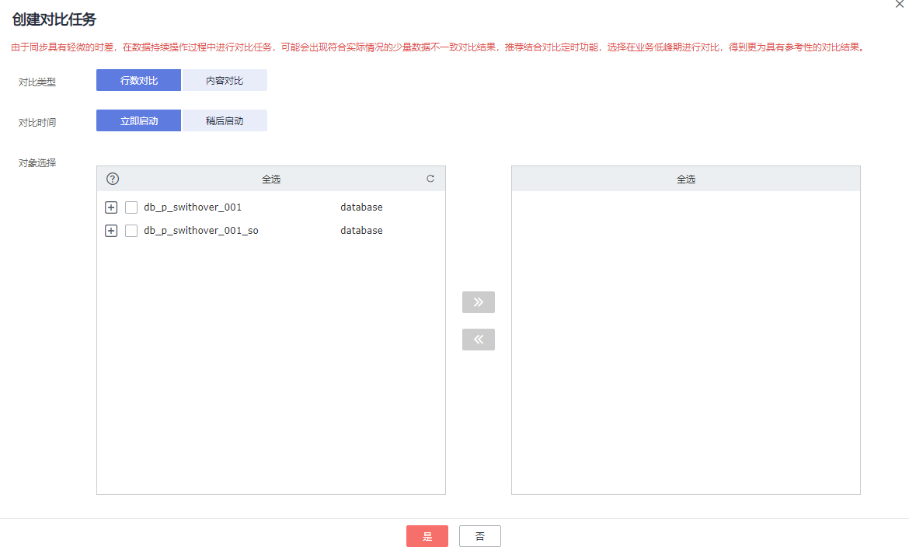

# 步骤四：对比灾备项

对比灾备项可以对比业务数据库和灾备数据库的数据一致性。灾备对比功能支持对象级对比和数据级对比。

-   对象级对比：支持对数据库、索引、表、视图、存储过程和函数等对象进行对比。
-   数据级对比：支持对表的行数和内容进行对比。为了确保对比结果具有可参考性，请通过“稍后启动“功能在业务低峰期或者无业务期进行数据对比，业务运行期间由于数据的持续变化，仅适合对一些业务的低频率修改的冷数据进行对比。

    > **说明：** 
    >如果单独对灾备库进行数据修改操作，有可能数据检验不准确。

## 前提条件

已登录数据复制服务控制台。

## 操作步骤

1.  在“实时灾备管理“界面，选中指定灾备任务，单击任务名称，进入“基本信息”页签。
2.  单击“灾备对比“页签，进入“灾备对比”信息页面，对业务数据库和灾备数据库的数据进行对比分析。
    1.  首先进行数据库对象完整性检查。

        在“对象级对比”页签，单击“开始对比“后稍等一段时间再单击，查看各个对比项的对比结果。

        **图 1**  灾备任务对象级对比  
        

        若需要查看对比项的对比结果详情，可单击指定对比项操作列的“详情”。

    2.  数据库对象检查完成后，进行灾备数据行数和内容对比。

        在“数据级对比”页签，单击“创建对比任务”页面，选择“对比类型”、“对比方式”、“对比时间”和“对象选择”，单击“确定”，提交对比任务。

        **图 2**  灾备创建对比任务  
        

        -   对比类型：分为行数对比和内容对比。
        -   对比方式：分为静态对比和动态对比两种。
            -   静态对比：对源数据库和目标数据库进行一次全量内容对比，内容对比完成后对比任务结束，适用于无数据变化的非业务时间。
            -   动态对比：先对源数据库和目标数据库进行一次全量内容对比，对比任务完成后进入增量对比阶段，实时比对源数据库和目标数据库的增量数据，适用于有数据变化的业务时间。

                > **说明：** 
                >目前仅MySQL和GaussDB\(for MySQL\)引擎支持对比方式选择。

        -   对比时间：可设置为“立即启动“和“稍后启动“。由于同步具有轻微的时差，在数据持续操作过程中进行对比任务，可能会出现符合实际情况的少量数据不一致对比结果，推荐结合对比定时功能，选择在业务低峰期进行对比，得到更为具有参考性的对比结果。
        -   对象选择：可根据具体的业务场景选择需要进行对比的对象。

        > **说明：** 
        >-   初始化中的任务无法进行数据级对比。

    3.  对比任务提交成功后，返回“数据级对比”页签，单击刷新列表，可以查看到所选对比类型的对比结果。

        **图 3**  灾备任务数据级对比结果  
        

    4.  若需要查看对比类型详情，可单击指定对比类型操作列的“查看对比报表”，然后选择需要进行对比的数据库，单击操作列的“查看详情”，查看指定业务数据库和灾备数据库的对比结果详情。若需要下载对比结果，可单击指定对比类型操作列的“导出报告”。

        **图 4**  灾备任务对比详情  
        

        > **说明：** 
        >已取消的对比任务也支持查看对比报表。

