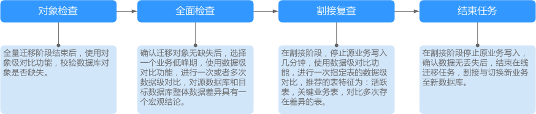

# 步骤四：对比迁移项

对比迁移项可以清晰反馈出源数据库和目标数据库的数据是否存在差异。为了尽可能减少业务的影响和业务中断时间，数据库实时迁移场景提供了完整的迁移对比流程，帮助您确定合适的业务割接时机。

**图 1**  迁移对比流程  

迁移对比功能支持对象级对比、数据级对比和用户对比。

-   对象级对比：支持对数据库、索引、表、视图、存储过程和函数、表的排序规则等对象进行对比。
-   数据级对比：支持对表或者集合的行数和内容进行对比。

    > **说明：** 
    >-   全量迁移中的任务无法进行数据级对比。
    >-   部分数据类型不支持内容对比，详情参考[内容对比不支持哪些数据类型](https://support.huaweicloud.com/drs_faq/drs_16_1130.html)。

-   用户对比：对源库和目标库的账号名称、权限进行对比。

## 前提条件

-   已登录数据复制服务控制台。
-   已启动迁移任务。

## 操作步骤

在进行迁移项数据对比时，您可以按照迁移对比须知模块推荐的流程操作，也可以根据业务场景选用对比方式。以下操作将按照迁移对比须知模块的推荐方案详细介绍各功能的使用方法。

1.  在“实时迁移管理“界面，选中指定迁移任务，单击任务名称，进入“基本信息”页签。
2.  单击“迁移对比“页签，进入“迁移对比”信息页面，对源数据库和目标数据库的数据进行对比分析。

    您也可以在“实时迁移管理“界面，选中指定迁移任务，单击操作列的“查看对比”，进入“迁移对比“页面。

    1.  首先进行数据库对象完整性检查。

        单击“对象检查”，进入“对象级对比”页签，单击“开始对比“后稍等一段时间再单击，查看各个对比项的对比结果。

        **图 2**  对象级对比  
        

        若需要查看对比项的对比结果详情，可单击指定对比项操作列的“详情”。

    2.  数据库对象检查完成后，进行迁移数据行数及内容的对比。

        如果仅需要对比全部迁移对象的行数，您也可以在“实时迁移管理“界面，选中指定迁移任务，单击操作列的“创建对比”，创建对比任务。

        1.  单击迁移对比须知处的“全面检查”，进入“创建对比任务“页面。
        2.  在“创建对比任务“页面，分别选择“对比类型”、“对比方式”、“对比时间”和“对象选择”后，单击“是”，提交对比任务。

            **图 3**  创建对比任务  
            

            -   对比类型：分为行数对比和内容对比。
            -   对比方式：分为静态对比和动态对比两种。
                -   静态对比：对源数据库和目标数据库进行一次全量内容对比，内容对比完成后对比任务结束，适用于无数据变化的非业务时间。
                -   动态对比：先对源数据库和目标数据库进行一次全量内容对比，对比任务完成后进入增量对比阶段，实时比对源数据库和目标数据库的增量数据，适用于有数据变化的业务时间。

                    > **说明：** 
                    >目前仅MySQL和PostgreSQL引擎支持对比方式选择。

            -   对比时间：可设置为“立即启动“和“稍后启动“。由于同步具有轻微的时差，在数据持续操作过程中进行对比任务，可能会出现符合实际情况的少量数据不一致对比结果，推荐结合对比定时功能，选择在业务低峰期进行对比，得到更为具有参考性的对比结果。
            -   对象选择：可根据具体的业务场景选择需要进行对比的对象。

            > **说明：** 
            >-   进行内容对比之前，系统会帮助您对内容对比所需的耗时进行预估。
            >-   选择对象的时候，对象名称的前后空格不显示，中间如有多个空格只显示一个空格。

            对比任务提交成功后，返回“数据级对比”页签，单击刷新列表，可以查看到所选对比类型的对比结果。

            **图 4**  数据级对比结果  
            

            若需要查看对比类型详情，可单击指定对比类型操作列的“查看对比报表”，然后选择需要进行对比的数据库，单击操作列的“查看详情”，查看指定源数据库和目标数据库的对比结果详情。

            **图 5**  对比详情  
            

            > **说明：** 
            >运行中的任务可以随时取消，已取消的对比任务也支持查看对比报表。

            进行数据库账号和权限对比。单击“用户对比“页签，可查看数据库账号及权限的对比结果。

            **图 6**  用户对比  
            

            > **说明：** 
            >-   全量迁移中的任务无法进行用户对比。

    3.  业务割接前，进行割接复查。

        单击“割接复查”，进入创建对比任务页面，选择“对比类型”、“对比时间”和“对象选择”，单击“确定”，提交对比任务。

        查看对比详情的方法请参考[2.b](#li28278341571)。

    4.  结束任务。

        业务系统和数据库切换成功后，为了防止源数据库的操作继续同步到目标数据库，造成数据覆盖问题，此时您可选择结束迁移任务。该操作仅删除了迁移实例，迁移任务仍显示在任务列表中，您可以进行查看或删除。结束迁移任务后，DRS将不再计费。

        一般情况下，结束任务功能可以确保特殊对象迁移的完整性（触发器、事件在结束阶段迁移），罕见情况下（例如网络异常）可能结束任务失败。当遇到多次任务结束失败时，可以勾选“强制结束任务“优先结束任务，以减少等待时间。强制结束任务，极端场景下可能会导致触发器、事件迁移不完整，请手工迁移触发器、事件。

