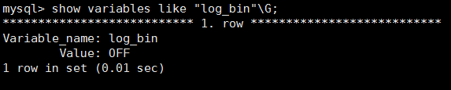
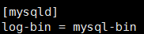
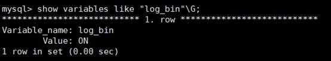

# 源数据库binlog日志是否开启

## MySQL迁移场景

**表 1**  源数据库binlog日志是否开启

<table><tbody><tr id="row6364655919632"><th class="firstcol" valign="top" width="11%" id="mcps1.2.3.1.1">
<strong id="b22974252191949">预检查项</strong>

</th>
<td class="cellrowborder" valign="top" width="89%" headers="mcps1.2.3.1.1 ">
源数据库binlog日志是否开启。

</td>
</tr>
<tr id="row4711154819632"><th class="firstcol" valign="top" width="11%" id="mcps1.2.3.2.1">
<strong id="b7561711191949">描述</strong>

</th>
<td class="cellrowborder" valign="top" width="89%" headers="mcps1.2.3.2.1 ">
检查源库是否开启了binlog日志功能。

</td>
</tr>
<tr id="row2611577919632"><th class="firstcol" rowspan="4" valign="top" width="11%" id="mcps1.2.3.3.1">
<strong id="b18937028191949">不通过提示及<strong id="b14490151682817">处理建议</strong></strong>

</th>
<td class="cellrowborder" valign="top" width="89%" headers="mcps1.2.3.3.1 ">
<strong id="b6416132361612">不通过原因</strong>：源数据库连接失败，导致该项检查无法进行。

<strong id="b14408155473114">处理建议</strong>：查看源数据库连接是否成功。

</td>
</tr>
<tr id="row18846133810176"><td class="cellrowborder" valign="top" headers="mcps1.2.3.3.1 ">
<strong id="b892114819180">不通过原因</strong>：用户基本权限不足。

<strong id="b540945712315">处理建议</strong>：查看对应数据库帐号权限是否符合迁移要求。

 说明： 

DRS要求的MySQL权限以及授权操作，请参见<a href="https://support.huaweicloud.com/drs_faq/drs_04_0034.html" target="_blank" rel="noopener noreferrer">DRS要求的MySQL权限有哪些</a>。

</td>
</tr>
<tr id="row82211415171"><td class="cellrowborder" valign="top" headers="mcps1.2.3.3.1 ">
<strong id="b144821849121810">不通过原因</strong>：内部错误。

<strong id="b65021459123119">处理建议</strong>：请联系华为技术支持人员处理。

</td>
</tr>
<tr id="row1605119819632"><td class="cellrowborder" valign="top" headers="mcps1.2.3.3.1 ">
<strong id="b6450172781213">不通过原因</strong>：源数据库未开启binlog日志功能。

<strong id="b118257771318">处理建议</strong>：

<ul id="ul1578371832611"><li>如果源数据库为本地自建库，建议参考如下操作开启binlog日志。<ol id="ol1378310183261"><li>查看binlog日志是否开启。<pre class="codeblock" id="codeblock1278313187263">show variables like "log_bin"\G;</pre>

</li><li>如果是关闭状态，在mysql配置文件my.cnf或my.ini中的[mysqld]标签下增加一行log-bin = mysql-bin。

</li><li>重启数据库。

</li></ol>
</li><li>如果源数据库为云上RDS实例，可建议联系技术人员进行处理。</li></ul>
</td>
</tr>
</tbody>
</table>

