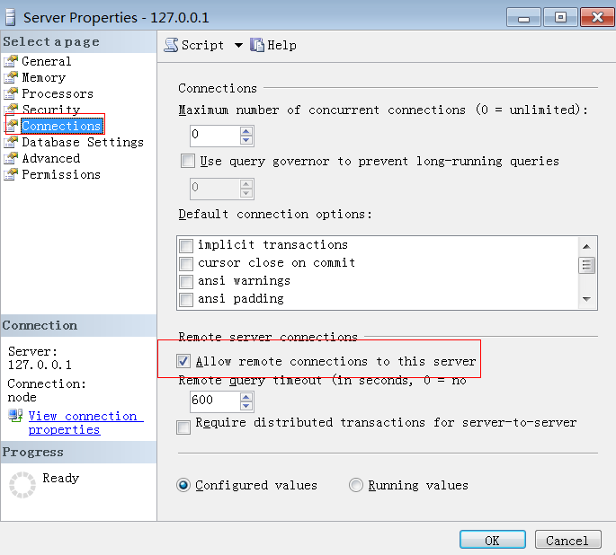

# 源数据库是否支持远程连接

## 源数据库为Microsoft SQL Server数据库

**表 1**  源数据库是否支持远程连接

<table><tbody><tr id="row7648298173720"><th class="firstcol" valign="top" width="8.459999999999999%" id="mcps1.2.3.1.1">
<strong id="b5573554173720">预检查项</strong>

</th>
<td class="cellrowborder" valign="top" width="91.53999999999999%" headers="mcps1.2.3.1.1 ">
校验源数据库是否支持远程连接。

</td>
</tr>
<tr id="row36589175173720"><th class="firstcol" valign="top" width="8.459999999999999%" id="mcps1.2.3.2.1">
<strong id="b31289932173720">描述</strong>

</th>
<td class="cellrowborder" valign="top" width="91.53999999999999%" headers="mcps1.2.3.2.1 ">
源数据库没有开启远程连接开关，就不允许执行远程存储过程，会导致迁移失败。

</td>
</tr>
<tr id="row60456205173720"><th class="firstcol" rowspan="3" valign="top" width="8.459999999999999%" id="mcps1.2.3.3.1">
<strong id="b49159004173720">失败提示及处理建议</strong>

</th>
<td class="cellrowborder" valign="top" width="91.53999999999999%" headers="mcps1.2.3.3.1 ">
<strong id="b18578245144019">失败原因</strong>：源数据库连接失败，导致该项检查无法进行。

<strong id="b166975783812">处理建议</strong>：查看源数据库连接是否成功。

</td>
</tr>
<tr id="row780643173720"><td class="cellrowborder" valign="top" headers="mcps1.2.3.3.1 ">
<strong id="b119921636411">失败原因</strong>：源数据库不允许远程执行存储过程。

<strong id="b16822611133812">处理建议</strong>：

执行以下语句，查看远程连接开关是否开启。<pre class="codeblock" id="codeblock20639479174851">use master;</pre>
<pre class="codeblock" id="codeblock62064760175116">select value_in_use from sys.configurations where name = 'remote access';</pre>
<ul id="ul19940213175221"><li>1表示开启。</li><li>0表示没有开启。</li></ul>

如果没有开启远程连接开关，则确保连接属性中远程开关是勾选的，并重启数据库。

</td>
</tr>
<tr id="row1356345853918"><td class="cellrowborder" valign="top" headers="mcps1.2.3.3.1 ">
<strong id="b17820196154120">失败原因</strong>：内部错误。

<strong id="b11962151415381">处理建议</strong>：请联系客服人员处理。

</td>
</tr>
</tbody>
</table>

