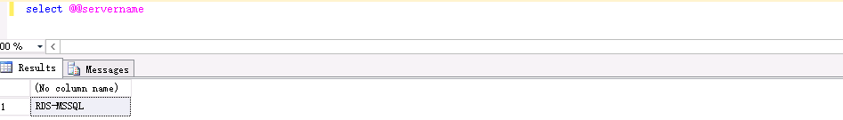
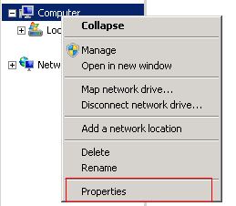
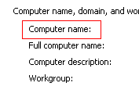
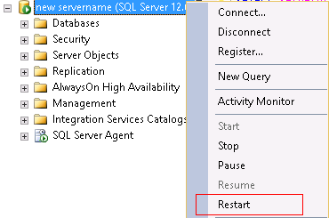

# 源数据库服务器与计算机名是否一致

## Microsoft SQL Server数据库

**表 1**  源数据库服务器与计算机名是否一致

<table><tbody><tr id="row2599816919624"><th class="firstcol" valign="top" width="8.72%" id="mcps1.2.3.1.1">
<strong id="b56695634191931">预检查项</strong>

</th>
<td class="cellrowborder" valign="top" width="91.28%" headers="mcps1.2.3.1.1 ">
源数据库服务器与计算机名是否一致。

</td>
</tr>
<tr id="row5314419219624"><th class="firstcol" valign="top" width="8.72%" id="mcps1.2.3.2.1">
<strong id="b62735832191931">描述</strong>

</th>
<td class="cellrowborder" valign="top" width="91.28%" headers="mcps1.2.3.2.1 ">
校验用户当前的计算机名与安装Microsoft SQL Server时的计算机名是否一致，即安装Microsoft SQL Server后是否有更改计算机名。

</td>
</tr>
<tr id="row3381416819624"><th class="firstcol" rowspan="3" valign="top" width="8.72%" id="mcps1.2.3.3.1">
<strong id="b31131775191931">失败提示及处理建议</strong>

</th>
<td class="cellrowborder" valign="top" width="91.28%" headers="mcps1.2.3.3.1 ">
<strong id="b98181275913">失败原因</strong>：源数据库连接失败，导致该项检查无法进行。

<strong id="b117671048113514">处理建议</strong>：查看源数据库连接是否成功。

</td>
</tr>
<tr id="row5840174313563"><td class="cellrowborder" valign="top" headers="mcps1.2.3.3.1 ">
<strong id="b173881010594">失败原因</strong>：服务器名与计算机名不一致。

<strong id="b10954955143519">处理建议</strong>：

通过如下操作查看服务器与计算机名是否一致。

<ol id="ol20343153725511"><li id="li153591137135517">使用如下命令查看SQL Server中存储的源库服务器名。
<strong id="b193591537155514">select @@servername</strong>

</li><li id="li1735913719551">查看当前计算机名。
查看计算机名的方法有多种，以下介绍常见的3种方法：

方法一：使用如下命令，可以查看当前的计算机名。

<strong id="b535933715554">select serverproperty('servername')</strong>

方法二：在cmd中使用<strong id="b1359173755510">hostname</strong>，可以查看当前的计算机名。

方法三：通过下图方式查看计算机属性，就可以查看到当前的计算机名。

</li><li>若两者不一致，修改Microsoft SQL Server中存储的服务器名。
<strong id="b2035903755516">exec sp_dropserver 'old servername'</strong>

此处old servername为<a href="#drs_11_0026__li153591137135517">1</a>中查到的结果。

<strong id="b5359193715511">exec sp_addserver 'new servername','local'</strong>

此处new servername为<a href="#drs_11_0026__li1735913719551">2</a>中查到的结果。

修改完之后，重启实例即可。

</li><li>查看此时的服务器名与计算机名是否一致。</li></ol>
</td>
</tr>
<tr id="row279789819624"><td class="cellrowborder" valign="top" headers="mcps1.2.3.3.1 ">
<strong id="b16301152075914">失败原因</strong>：内部错误。

<strong id="b11439180173619">处理建议</strong>：请联系客服人员处理。

</td>
</tr>
</tbody>
</table>

