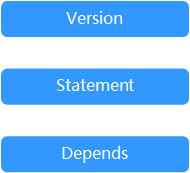

# 策略语法：RBAC<a name="drs_08_0013"></a>

## 策略结构<a name="section7265415321"></a>

策略结构包括：策略版本号（Version）、策略授权语句（Statement）和策略依赖（Depends）。

**图 1**  策略结构<a name="fig2051120141815"></a>  


## 策略语法<a name="section52758151924"></a>

如下以DRS服务的“DRS Administraor”为例，说明RBAC策略语法。

**图 2**  RBAC策略语法<a name="fig4964735394"></a>  


```
{
        "Version": "1.0",
        "Statement": [
                {
                        "Effect": "Allow",
                        "Action": [
                                "DRS:DRS:*"
                        ]
                }
        ],
        "Depends": [
                {
                        "catalog": "BASE",
                        "display_name": "Server Administrator"
                },
                {
                        "catalog": "BASE",
                        "display_name": "Tenant Guest"
                },
                {
                        "catalog": "RDS",
                        "display_name": "RDS Administrator"
                }
        ]
}
```

**表 1**  参数说明

<a name="table527771519210"></a>
<table><thead align="left"><tr id="row174241015726"><th class="cellrowborder" colspan="2" valign="top" id="mcps1.2.5.1.1"><p id="p1342411512217"><a name="p1342411512217"></a><a name="p1342411512217"></a>参数</p>
</th>
<th class="cellrowborder" valign="top" id="mcps1.2.5.1.2"><p id="p164241815227"><a name="p164241815227"></a><a name="p164241815227"></a>含义</p>
</th>
<th class="cellrowborder" valign="top" id="mcps1.2.5.1.3"><p id="p18424615221"><a name="p18424615221"></a><a name="p18424615221"></a>值</p>
</th>
</tr>
</thead>
<tbody><tr id="row842410151124"><td class="cellrowborder" colspan="2" valign="top" headers="mcps1.2.5.1.1 "><p id="p842491517219"><a name="p842491517219"></a><a name="p842491517219"></a>Version</p>
</td>
<td class="cellrowborder" valign="top" headers="mcps1.2.5.1.2 "><p id="p144243151226"><a name="p144243151226"></a><a name="p144243151226"></a>策略的版本</p>
</td>
<td class="cellrowborder" valign="top" headers="mcps1.2.5.1.3 "><p id="p1842491518220"><a name="p1842491518220"></a><a name="p1842491518220"></a>固定为“1.0”</p>
</td>
</tr>
<tr id="row114240152022"><td class="cellrowborder" rowspan="2" valign="top" width="17.17171717171717%" headers="mcps1.2.5.1.1 "><p id="p342413151219"><a name="p342413151219"></a><a name="p342413151219"></a>Statement</p>
</td>
<td class="cellrowborder" valign="top" width="17.17171717171717%" headers="mcps1.2.5.1.1 "><p id="p442411151523"><a name="p442411151523"></a><a name="p442411151523"></a>Action</p>
</td>
<td class="cellrowborder" valign="top" width="28.28282828282828%" headers="mcps1.2.5.1.2 "><p id="p4424111513215"><a name="p4424111513215"></a><a name="p4424111513215"></a>定义对DRS的具体操作。</p>
</td>
<td class="cellrowborder" valign="top" width="37.37373737373737%" headers="mcps1.2.5.1.3 "><p id="p44241515624"><a name="p44241515624"></a><a name="p44241515624"></a>格式为：服务名:资源类型:操作</p>
<p id="p1642411514218"><a name="p1642411514218"></a><a name="p1642411514218"></a>"DRS:DRS:*"，表示对DRS的所有操作，其中DRS为服务名称；“*”为通配符，表示对所有的资源类型可以执行所有操作。</p>
</td>
</tr>
<tr id="row184246152215"><td class="cellrowborder" valign="top" headers="mcps1.2.5.1.1 "><p id="p124244151524"><a name="p124244151524"></a><a name="p124244151524"></a>Effect</p>
</td>
<td class="cellrowborder" valign="top" headers="mcps1.2.5.1.1 "><p id="p242415151218"><a name="p242415151218"></a><a name="p242415151218"></a>定义Action中所包含的具体操作是否允许执行。</p>
</td>
<td class="cellrowborder" valign="top" headers="mcps1.2.5.1.2 "><a name="ul14243151322"></a><a name="ul14243151322"></a><ul id="ul14243151322"><li>Allow：允许执行。</li><li>Deny：不允许执行。</li></ul>
</td>
</tr>
<tr id="row16424415523"><td class="cellrowborder" rowspan="2" valign="top" width="17.17171717171717%" headers="mcps1.2.5.1.1 "><p id="p17424151516215"><a name="p17424151516215"></a><a name="p17424151516215"></a>Depends</p>
</td>
<td class="cellrowborder" valign="top" width="17.17171717171717%" headers="mcps1.2.5.1.1 "><p id="p442412153212"><a name="p442412153212"></a><a name="p442412153212"></a>catalog</p>
</td>
<td class="cellrowborder" valign="top" width="28.28282828282828%" headers="mcps1.2.5.1.2 "><p id="p12424191513216"><a name="p12424191513216"></a><a name="p12424191513216"></a>依赖的策略的所属服务。</p>
</td>
<td class="cellrowborder" valign="top" width="37.37373737373737%" headers="mcps1.2.5.1.3 "><p id="p174241415929"><a name="p174241415929"></a><a name="p174241415929"></a>服务名称</p>
<p id="p184241615120"><a name="p184241615120"></a><a name="p184241615120"></a>例如：BASE</p>
</td>
</tr>
<tr id="row13424615127"><td class="cellrowborder" valign="top" headers="mcps1.2.5.1.1 "><p id="p8425615023"><a name="p8425615023"></a><a name="p8425615023"></a>display_name</p>
</td>
<td class="cellrowborder" valign="top" headers="mcps1.2.5.1.1 "><p id="p1425215720"><a name="p1425215720"></a><a name="p1425215720"></a>依赖的策略的名称。</p>
</td>
<td class="cellrowborder" valign="top" headers="mcps1.2.5.1.2 "><p id="p1542591516218"><a name="p1542591516218"></a><a name="p1542591516218"></a>权限名称</p>
<p id="p742511514217"><a name="p742511514217"></a><a name="p742511514217"></a>例如：RDS Administrator</p>
</td>
</tr>
</tbody>
</table>

## 系统策略<a name="section487905481215"></a>

更多DRS支持的系统策略及策略间的对比，请参见：[DRS系统策略](https://support.huaweicloud.com/productdesc-drs/drs_01_0201.html)。

**表 2**  DRS系统策略

<a name="table1531810181619"></a>
<table><thead align="left"><tr id="drs_01_0201_row349393677"><th class="cellrowborder" valign="top" width="17.348265173482652%" id="mcps1.2.4.1.1"><p id="drs_01_0201_p74931320712"><a name="drs_01_0201_p74931320712"></a><a name="drs_01_0201_p74931320712"></a><strong id="drs_01_0201_b2082185815160"><a name="drs_01_0201_b2082185815160"></a><a name="drs_01_0201_b2082185815160"></a>策略名称</strong></p>
</th>
<th class="cellrowborder" valign="top" width="44.89551044895511%" id="mcps1.2.4.1.2"><p id="drs_01_0201_p16493133576"><a name="drs_01_0201_p16493133576"></a><a name="drs_01_0201_p16493133576"></a><strong id="drs_01_0201_b13834589163"><a name="drs_01_0201_b13834589163"></a><a name="drs_01_0201_b13834589163"></a>描述</strong></p>
</th>
<th class="cellrowborder" valign="top" width="37.75622437756224%" id="mcps1.2.4.1.3"><p id="drs_01_0201_p124931837719"><a name="drs_01_0201_p124931837719"></a><a name="drs_01_0201_p124931837719"></a><strong id="drs_01_0201_b128475816167"><a name="drs_01_0201_b128475816167"></a><a name="drs_01_0201_b128475816167"></a>依赖关系</strong></p>
</th>
</tr>
</thead>
<tbody><tr id="drs_01_0201_row249317311710"><td class="cellrowborder" valign="top" width="17.348265173482652%" headers="mcps1.2.4.1.1 "><p id="drs_01_0201_p0493232712"><a name="drs_01_0201_p0493232712"></a><a name="drs_01_0201_p0493232712"></a>DRS Administrator</p>
</td>
<td class="cellrowborder" valign="top" width="44.89551044895511%" headers="mcps1.2.4.1.2 "><p id="drs_01_0201_p7493139719"><a name="drs_01_0201_p7493139719"></a><a name="drs_01_0201_p7493139719"></a>数据复制服务的管理员。</p>
<p id="drs_01_0201_p6263201117419"><a name="drs_01_0201_p6263201117419"></a><a name="drs_01_0201_p6263201117419"></a>该权限为使用数据复制服务时必须添加的基础权限。</p>
</td>
<td class="cellrowborder" valign="top" width="37.75622437756224%" headers="mcps1.2.4.1.3 "><p id="drs_01_0201_p24932317711"><a name="drs_01_0201_p24932317711"></a><a name="drs_01_0201_p24932317711"></a>依赖Tenant Guest、Server Administrator和RDS Administrator策略。</p>
<a name="drs_01_0201_ul94931431476"></a><a name="drs_01_0201_ul94931431476"></a><ul id="drs_01_0201_ul94931431476"><li>Tenant Guest：全部云服务只读权限，属于项目级策略，在同项目中勾选。</li><li>Server Administrator：服务器管理员，属于项目级策略，在同项目中勾选。</li><li>RDS Administrator：RDS管理员，属于项目级策略，在同项目中勾选。</li></ul>
</td>
</tr>
<tr id="drs_01_0201_row0476823182220"><td class="cellrowborder" valign="top" width="17.348265173482652%" headers="mcps1.2.4.1.1 "><p id="drs_01_0201_p918616298220"><a name="drs_01_0201_p918616298220"></a><a name="drs_01_0201_p918616298220"></a>Security Administrator</p>
</td>
<td class="cellrowborder" valign="top" width="44.89551044895511%" headers="mcps1.2.4.1.2 "><p id="drs_01_0201_p6976894556"><a name="drs_01_0201_p6976894556"></a><a name="drs_01_0201_p6976894556"></a>安全管理员。</p>
<p id="drs_01_0201_p1186152918226"><a name="drs_01_0201_p1186152918226"></a><a name="drs_01_0201_p1186152918226"></a>为了提高数据复制服务的使用性能，您需要在正式使用数据复制服务之前，在统一身份认证服务用户组管理中添加Security Administrator全局权限，避免由于权限问题造成某些功能不可用。如定时启动任务、全量完成自动结束、自动重试失败任务等。</p>
</td>
<td class="cellrowborder" valign="top" width="37.75622437756224%" headers="mcps1.2.4.1.3 "><p id="drs_01_0201_p131861029112217"><a name="drs_01_0201_p131861029112217"></a><a name="drs_01_0201_p131861029112217"></a>无。</p>
</td>
</tr>
</tbody>
</table>

**表 3**  常用操作与系统策略的关系

<a name="table1089413113162"></a>
<table><thead align="left"><tr id="drs_01_0201_row7494033715"><th class="cellrowborder" valign="top" width="44.61%" id="mcps1.2.3.1.1"><p id="drs_01_0201_p194941731875"><a name="drs_01_0201_p194941731875"></a><a name="drs_01_0201_p194941731875"></a><strong id="drs_01_0201_b11347727154019"><a name="drs_01_0201_b11347727154019"></a><a name="drs_01_0201_b11347727154019"></a>操作</strong></p>
</th>
<th class="cellrowborder" valign="top" width="55.38999999999999%" id="mcps1.2.3.1.2"><p id="drs_01_0201_p1079015231400"><a name="drs_01_0201_p1079015231400"></a><a name="drs_01_0201_p1079015231400"></a><strong id="drs_01_0201_b5350192716407"><a name="drs_01_0201_b5350192716407"></a><a name="drs_01_0201_b5350192716407"></a>DRS Administrator</strong></p>
</th>
</tr>
</thead>
<tbody><tr id="drs_01_0201_row04951331575"><td class="cellrowborder" valign="top" width="44.61%" headers="mcps1.2.3.1.1 "><p id="drs_01_0201_p68681656165613"><a name="drs_01_0201_p68681656165613"></a><a name="drs_01_0201_p68681656165613"></a>创建任务</p>
</td>
<td class="cellrowborder" valign="top" width="55.38999999999999%" headers="mcps1.2.3.1.2 "><p id="drs_01_0201_p7495934716"><a name="drs_01_0201_p7495934716"></a><a name="drs_01_0201_p7495934716"></a>√</p>
</td>
</tr>
<tr id="drs_01_0201_row149523677"><td class="cellrowborder" valign="top" width="44.61%" headers="mcps1.2.3.1.1 "><p id="drs_01_0201_p486825610562"><a name="drs_01_0201_p486825610562"></a><a name="drs_01_0201_p486825610562"></a>编辑任务</p>
</td>
<td class="cellrowborder" valign="top" width="55.38999999999999%" headers="mcps1.2.3.1.2 "><p id="drs_01_0201_p18495838712"><a name="drs_01_0201_p18495838712"></a><a name="drs_01_0201_p18495838712"></a>√</p>
</td>
</tr>
<tr id="drs_01_0201_row149553470"><td class="cellrowborder" valign="top" width="44.61%" headers="mcps1.2.3.1.1 "><p id="drs_01_0201_p4884105695615"><a name="drs_01_0201_p4884105695615"></a><a name="drs_01_0201_p4884105695615"></a>删除任务</p>
</td>
<td class="cellrowborder" valign="top" width="55.38999999999999%" headers="mcps1.2.3.1.2 "><p id="drs_01_0201_p94955314717"><a name="drs_01_0201_p94955314717"></a><a name="drs_01_0201_p94955314717"></a>√</p>
</td>
</tr>
<tr id="drs_01_0201_row13496831274"><td class="cellrowborder" valign="top" width="44.61%" headers="mcps1.2.3.1.1 "><p id="drs_01_0201_p2395183115713"><a name="drs_01_0201_p2395183115713"></a><a name="drs_01_0201_p2395183115713"></a>启动任务</p>
</td>
<td class="cellrowborder" valign="top" width="55.38999999999999%" headers="mcps1.2.3.1.2 "><p id="drs_01_0201_p449623072"><a name="drs_01_0201_p449623072"></a><a name="drs_01_0201_p449623072"></a>√</p>
</td>
</tr>
<tr id="drs_01_0201_row94961234713"><td class="cellrowborder" valign="top" width="44.61%" headers="mcps1.2.3.1.1 "><p id="drs_01_0201_p7395737576"><a name="drs_01_0201_p7395737576"></a><a name="drs_01_0201_p7395737576"></a>重试任务</p>
</td>
<td class="cellrowborder" valign="top" width="55.38999999999999%" headers="mcps1.2.3.1.2 "><p id="drs_01_0201_p18496932714"><a name="drs_01_0201_p18496932714"></a><a name="drs_01_0201_p18496932714"></a>√</p>
</td>
</tr>
<tr id="drs_01_0201_row1883765561511"><td class="cellrowborder" valign="top" width="44.61%" headers="mcps1.2.3.1.1 "><p id="drs_01_0201_p1183835541514"><a name="drs_01_0201_p1183835541514"></a><a name="drs_01_0201_p1183835541514"></a>结束任务</p>
</td>
<td class="cellrowborder" valign="top" width="55.38999999999999%" headers="mcps1.2.3.1.2 "><p id="drs_01_0201_p283885531513"><a name="drs_01_0201_p283885531513"></a><a name="drs_01_0201_p283885531513"></a>√</p>
</td>
</tr>
</tbody>
</table>

