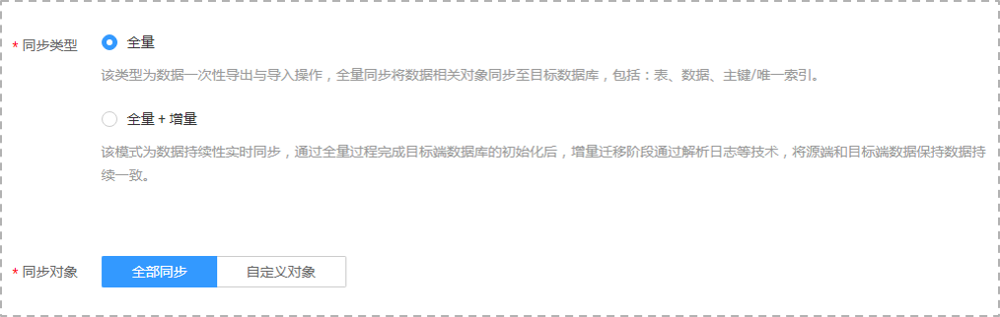

# 编辑同步任务

数据复制服务支持编辑数据同步任务的配置信息，包括源库信息、目标库信息。创建实例后，对于如下状态的任务，您可再次编辑并提交同步任务。

-   创建中
-   配置

## 前提条件

已登录数据复制服务控制台。

## 方式一

1.  在“数据同步管理“页面的任务列表中，选择要修改的任务，单击操作列“编辑“按钮。
2.  进入“源库及目标库“页面，填写源库和目标库信息，单击“下一步”。
3.  在“设定同步“页面，选择数据同步模式和对象，单击“下一步“。

    **图 1**  同步模式  
    

    **表 1**  同步模式和对象

    
    <table><thead align="left"><tr id="zh-cn_topic_0141892586_row165921632141911"><th class="cellrowborder" valign="top" width="16%" id="mcps1.2.3.1.1">
<strong id="zh-cn_topic_0141892586_b1783318515228">参数</strong>

    </th>
    <th class="cellrowborder" valign="top" width="84%" id="mcps1.2.3.1.2">
<strong id="zh-cn_topic_0141892586_b10555114922418">描述</strong>

    </th>
    </tr>
    </thead>
    <tbody><tr id="zh-cn_topic_0141892586_row2059243216195"><td class="cellrowborder" valign="top" width="16%" headers="mcps1.2.3.1.1 ">
同步类型

    </td>
    <td class="cellrowborder" valign="top" width="84%" headers="mcps1.2.3.1.2 "><ul id="zh-cn_topic_0141892586_ul7499112610579"><li>全量：该类型为数据一次性导出与导入操作，全量同步将数据相关对象同步至目标数据库，包括：表、数据、主键或唯一索引。
 说明： 

如果用户只进行全量同步时，建议停止对源数据库的操作，否则同步过程中源数据库产生的新数据不会同步到目标数据库。

    

    </li><li>全量+增量
该模式为数据持续性实时同步，通过全量过程完成目标端数据库的初始化后，增量同步阶段通过解析日志等技术，将源端和目标端数据保持数据持续持续一致。

    </li></ul>
    
 说明： 

选择“全量+增量”同步模式，增量同步可以在全量同步完成的基础上实现数据的持续同步，无需中断业务，实现同步过程中源业务和数据库继续对外提供访问。

    

    </td>
    </tr>
    <tr id="zh-cn_topic_0141892586_row559273214193"><td class="cellrowborder" valign="top" width="16%" headers="mcps1.2.3.1.1 ">
同步对象

    </td>
    <td class="cellrowborder" valign="top" width="84%" headers="mcps1.2.3.1.2 ">
同步对象支持的粒度可以为库、表、主键或索引，对象同步到目标数据库实例后，对象名将会保持与源数据库实例对象名一致且无法修改。

    </td>
    </tr>
    </tbody>
    </table>

4.  在“预检查“页面，进行同步任务预校验，校验是否可进行数据同步。
    -   查看检查结果，如有失败的检查项，需要修复失败项后，单击“重新校验”按钮重新进行任务预校验。

        预检查失败项处理建议请参见《数据复制服务用户指南》中的“[预检查失败项修复方法](https://support.huaweicloud.com/usermanual-drs/drs_precheck.html)”。

    -   预检查完成后，且所有检查项结果均成功时，单击“下一步“

        **图 2**  预检查  
        

        > **说明：**   
        >所有检查项结果均成功时，若存在告警，需要阅读并确认告警详情后才可以继续执行下一步操作。  

5.  在“任务确认“页面，设置同步任务的启动时间，并确认同步任务信息无误后，勾选协议，单击“启动任务“，提交同步任务。

    > **说明：**   
    >-   同步任务的启动时间可以根据业务需求，设置为“立即启动”或“稍后启动”。  
    >-   预计同步任务启动后，会对源数据库和目标数据库的性能产生影响，建议选择业务低峰期，合理设置同步任务的启动时间。  

6.  同步任务提交后，您可在“数据同步管理“页面，查看并管理自己的任务。
    -   您可查看任务提交后的状态，状态请参见[任务状态](null.md)。
    -   在任务列表的右上角，单击刷新列表，可查看到最新的任务状态。

## 方式二

1.  在“数据同步管理“界面，选择指定同步任务，单击任务名称。
2.  单击“进入“，进入“源库及目标库“页面。
3.  执行[2](#li105671010104417)到[6](#li620112563620)。

