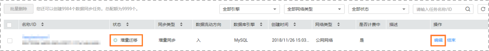
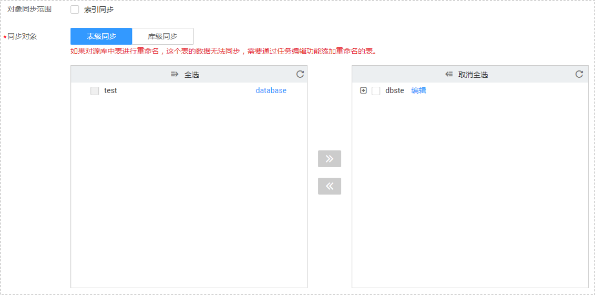

# 编辑同步对象

数据复制服务提供的数据同步功能可以对数据同步的对象进行修改。创建数据同步任务后，对于增量同步中的任务，您可以通过编辑同步对象来增加或者移除同步表，并提交同步任务。

目前仅MySQL-\>MySQL数据同步支持编辑同步对象。

## 前提条件

已登录数据复制服务控制台。

## 操作步骤

1.  在“数据同步管理”页面，选择需要修改同步对象的任务，单击操作列的“编辑”按钮。

    **图 1**  编辑数据同步对象  
    

2.  进入“设定同步”页面，修改需要同步的对象，单击“下一步”。

    **图 2**  修改同步对象  
    

3.  在“预检查“页面，进行同步任务预校验，校验是否可进行数据同步。
    -   查看检查结果，如有失败的检查项，需要修复失败项后，单击“重新校验”按钮重新进行任务预校验。

        预检查失败项处理建议请参见《数据复制服务用户指南》中的“[预检查失败项修复方法](https://support.huaweicloud.com/usermanual-drs/drs_precheck.html)”。

    -   预检查完成后，且所有检查项结果均成功时，单击右下角“立即生效“。

        **图 3**  预检查  
        

        > **说明：**   
        >所有检查项结果均成功时，若存在告警，需要阅读并确认告警详情后才可以继续执行下一步操作。  

4.  页面跳转至“数据同步管理“，在同步任务列表中，当前任务状态显示为“启动中“，该过程大约持续2-3分钟，待任务启动成功后，开始对编辑后的同步对象进行增量同步，状态显示为“增量同步“。

