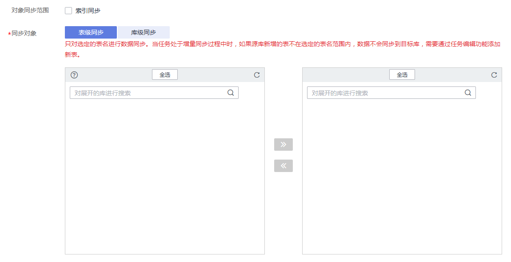

# 编辑同步对象

数据复制服务提供的实时同步功能可以对实时同步的对象进行修改。创建实时同步任务后，对于增量同步中的任务，您可以通过编辑同步对象来增加或者移除同步数据库和表，并提交同步任务。

## 前提条件

已登录数据复制服务控制台。

## 方法一

1.  在“实时同步管理”页面，选择需要修改同步对象的任务，单击操作列的“编辑”按钮。

    **图 1**  编辑实时同步对象  
    

2.  进入“设置同步”页面，修改需要同步的对象，单击“下一步”。

    **图 2**  修改同步对象  
    

3.  在“预检查“页面，进行同步任务预校验，校验是否可进行实时同步。
    -   查看检查结果，如有不通过的检查项，需要修复不通过项后，单击“重新校验”按钮重新进行任务预校验。

        预检查不通过项处理建议请参见《数据复制服务用户指南》中的“[预检查不通过项修复方法](https://support.huaweicloud.com/usermanual-drs/drs_precheck.html)”。

    -   预检查完成后，且所有检查项结果均通过时，单击“下一步“。

        **图 3**  同步预检查  
        

        > **说明：** 
        >所有检查项结果均通过时，若存在请确认项，需要阅读并确认详情后才可以继续执行下一步操作。

4.  页面跳转至“实时同步管理“，在同步任务列表中，当前任务状态显示为“增量同步“，并生成任务状态为“任务变更中“的子任务，待子任务变更完成后，开始对编辑后的同步对象进行增量同步。

## 方法二

1.  在“实时同步管理”页面，选择需要修改同步对象的任务，单击任务名称。
2.  页面跳转至“基本信息“，切换到“同步映射“页签，单击指定同步对象后面的“编辑“按钮。
3.  执行方法一的步骤[2](#li443419465279)到[4](#li0155332161410)。

