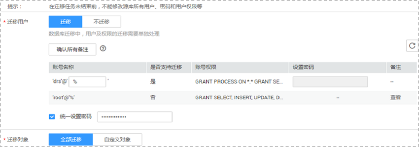
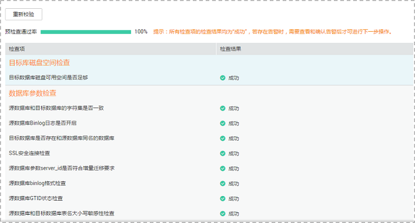

# 编辑在线迁移任务

数据复制服务支持编辑在线迁移任务的配置信息，包括任务信息、迁移实例信息和迁移信息。创建迁移实例后，对于如下状态的任务，您可再次编辑并提交迁移任务。

-   创建中
-   配置

## 方式一

1.  登录管理控制台。
2.  单击管理控制台左上角的，选择区域和项目。
3.  单击“服务列表”，选择“数据库“  \>  “数据复制服务“，进入数据复制服务管理控制台。
4.  在“在线迁移管理“页面的迁移列表中，选择要修改的任务，单击“编辑“。
5.  在“源库及目标库“页面，参考《数据复制服务快速入门》中的“[创建迁移任务](https://support.huaweicloud.com/qs-drs/drs_02_0002.html)”章节，填写源库和目标库信息。
6.  在“迁移模式“页面，选择迁移模式和迁移对象，单击“下一步“。

    **图 1**  迁移模式  
    

    **表 1**  迁移模式和迁移对象

    
    <table><thead align="left"><tr id="row165921632141911"><th class="cellrowborder" valign="top" width="18%" id="mcps1.2.3.1.1">
<strong id="b1783318515228">参数</strong>

    </th>
    <th class="cellrowborder" valign="top" width="82%" id="mcps1.2.3.1.2">
<strong id="b1375014457264">描述</strong>

    </th>
    </tr>
    </thead>
    <tbody><tr id="row2059243216195"><td class="cellrowborder" valign="top" width="18%" headers="mcps1.2.3.1.1 ">
全量

    </td>
    <td class="cellrowborder" valign="top" width="82%" headers="mcps1.2.3.1.2 ">
该模式为数据库一次性迁移，适用于可中断业务的数据库迁移场景，全量迁移将非系统数据库的全部数据库对象和数据一次性迁移至目标端数据库，包括：表、视图、存储过程、触发器等。

    
 NOTE: 

如果用户只进行全量迁移时，建议停止对源数据库的操作，否则迁移过程中源数据库产生的新数据不会同步到目标数据库。

    

    </td>
    </tr>
    <tr id="row2592193212194"><td class="cellrowborder" valign="top" width="18%" headers="mcps1.2.3.1.1 ">
全量+增量

    </td>
    <td class="cellrowborder" valign="top" width="82%" headers="mcps1.2.3.1.2 ">
该模式为数据库持续性迁移，适用于对业务中断敏感的场景，通过全量迁移过程中完成的目标端数据库的初始化后，增量迁移阶段通过解析日志等技术，将远端和目标端数据库保持数据持续一致。

    
 NOTE: 

选择<b>全量+增量</b>迁移模式，增量迁移可以在全量迁移完成的基础上实现数据的持续同步，无需中断业务，实现迁移过程中源业务和数据库继续对外提供访问。

    

    </td>
    </tr>
    <tr id="row559273214193"><td class="cellrowborder" valign="top" width="18%" headers="mcps1.2.3.1.1 ">
迁移对象

    </td>
    <td class="cellrowborder" valign="top" width="82%" headers="mcps1.2.3.1.2 ">
迁移对象选择的粒度可以为库和表，对象迁移到华为云目标数据库实例后，对象名将会保持与源数据库实例对象名一致且无法修改。

    
 NOTE: 

若选择部分数据库进行迁移时，由于触发器、存储过程、视图等对象可能与其他数据库的表存在依赖关系，若所依赖的表未迁移，则会导致迁移失败。建议您在迁移之前进行确认，或选择全部数据库进行迁移。

    

    </td>
    </tr>
    </tbody>
    </table>

7.  在“预检查“页面，进行迁移任务预校验，校验是否可进行迁移。
    -   查看检查结果，如有失败的检查项，需要修复失败项后，单击“重新校验”按钮重新进行迁移任务预校验。

        预检查失败项处理建议请参考《数据复制服务用户指南》中的“[预检查失败项修复方法](https://support.huaweicloud.com/usermanual-drs/drs_precheck.html)”。

    -   预检查完成后，所有检查项结果均成功时，单击“下一步“。

        **图 2**  预检查  
        

8.  在“任务确认“页面，设置迁移任务的启动时间，并确认迁移任务信息无误后，勾选协议，单击“启动任务“，提交迁移任务。
9.  迁移任务提交后，您可在“在线迁移管理“页面，查看并管理自己的任务。
    -   您可查看任务提交后的状态，状态请参见[迁移任务状态](https://support.huaweicloud.com/qs-drs/drs_01_0021.html)。
    -   在任务列表的右上角，单击刷新列表，可查看到最新的任务状态。

## 方式二

1.  登录管理控制台。
2.  单击管理控制台左上角的，选择区域和项目。
3.  选择“数据库“  \>  “数据复制服务“，进入数据复制服务管理控制台。
4.  在“在线迁移管理“界面，选择指定迁移任务，单击任务名称。
5.  单击“进入“，进入“源库及目标库“页面。
6.  执行[5](#li105671010104417)到[9](#li620112563620)。

