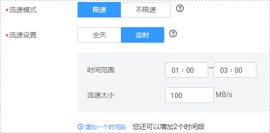
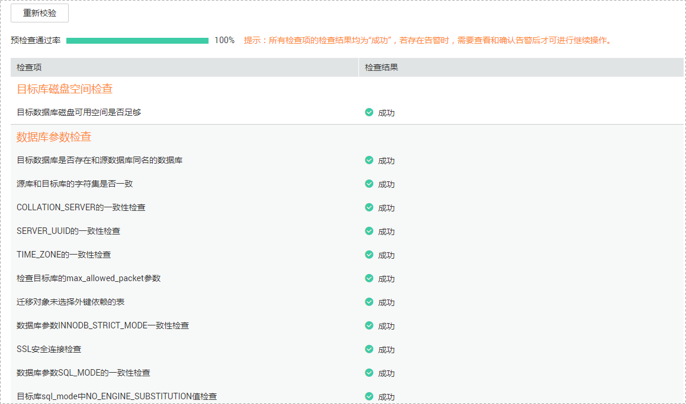

# 编辑迁移任务

数据复制服务支持编辑在线迁移任务的配置信息，包括任务信息、迁移实例信息和迁移信息。创建迁移实例后，对于如下状态的任务，您可再次编辑并提交迁移任务。

-   创建中
-   配置

## 前提条件

-   已登录数据复制服务控制台。
-   已成功创建迁移任务。

## 方式一

1.  在“在线迁移管理“页面的迁移列表中，选择要修改的任务，单击“编辑“。
2.  在“源库及目标库“页面，填写源库和目标库信息，单击“下一步”。
3.  在“迁移设置“页面，设置迁移用户和迁移对象，单击“下一步“。

    **图 1**  迁移模式  
    

    **表 1**  迁移模式和迁移对象

    
    <table><thead align="left"><tr id="zh-cn_topic_0078078071_zh-cn_topic_0135097933_zh-cn_topic_0078078071_row165921632141911"><th class="cellrowborder" valign="top" width="16%" id="mcps1.2.3.1.1">
<strong id="zh-cn_topic_0078078071_zh-cn_topic_0135097933_zh-cn_topic_0078078071_b1783318515228">参数</strong>

    </th>
    <th class="cellrowborder" valign="top" width="84%" id="mcps1.2.3.1.2">
<strong id="zh-cn_topic_0078078071_zh-cn_topic_0135097933_zh-cn_topic_0078078071_b10555114922418">描述</strong>

    </th>
    </tr>
    </thead>
    <tbody><tr id="zh-cn_topic_0078078071_zh-cn_topic_0135097933_zh-cn_topic_0078078071_row844211210119"><td class="cellrowborder" valign="top" width="16%" headers="mcps1.2.3.1.1 ">
快照模式

    </td>
    <td class="cellrowborder" valign="top" width="84%" headers="mcps1.2.3.1.2 ">
如果您选择的是全量迁移模式的任务，数据复制服务支持设置快照模式。

    <ul id="zh-cn_topic_0078078071_zh-cn_topic_0135097933_zh-cn_topic_0078078071_ul520619298172"><li>非快照式
适用于停止业务数据写入的导出，如果全量迁移中仍然有业务数据的修改，则导出数据为时间点非水平一致。稳定性和性能要优于快照式全量迁移。

    </li><li>快照式
可以在业务运行时产生一份时间水平一致的快照数据，具有业务数据分析价值，过程中的数据变化不会体现在导出数据中。

    
 说明： 
<ul id="zh-cn_topic_0078078071_zh-cn_topic_0135097933_zh-cn_topic_0078078071_ul58981133103"><li>快照读会使用MySQL备份锁进行全局锁表，在开启一致性读后自动解锁（加锁时间在3s以内），备份锁会对此期间的DML或者DDL操作造成阻塞，建议用户选择源库空闲的时间段使用快照备份功能。</li><li>目前仅MySQL全量模式的迁移任务支持快照模式设置。</li><li>在快照迁移时不允许执行DDL操作，否则会导致全量迁移失败。</li></ul>
    

    </li></ul>
    </td>
    </tr>
    <tr id="zh-cn_topic_0078078071_zh-cn_topic_0135097933_row863631683911"><td class="cellrowborder" valign="top" width="16%" headers="mcps1.2.3.1.1 ">
流速模式

    </td>
    <td class="cellrowborder" valign="top" width="84%" headers="mcps1.2.3.1.2 ">
流速模式支持限速和不限速，默认为不限速。

    <ul id="zh-cn_topic_0078078071_zh-cn_topic_0135097933_zh-cn_topic_0078078071_ul9762123112510"><li>限速：自定义的最大迁移速度，迁移过程中的迁移速度将不会超过该速度。
当流速模式选择了“限速”时，你需要通过流速设置来定时控制迁移速度。流速设置通常包括限速时间段和流速大小的设置。默认的限速时间段为全天，您也可以根据业务需求自定义定时限速。自定义的定时限速支持最多设置3个定时任务，每个定时任务之间不能存在交叉的时间段，未设定在限速时间段的时间默认为不限速。

    
流速的大小需要根据业务场景来设置，不能超过9999Mb/s。

    
<b>图1 </b>设置流速模式 

    </li><li>不限速：对迁移速度不进行限制，通常会最大化使用源数据库的出口带宽。该流速模式同时会对源数据库造成读消耗，消耗取决于源数据库的出口带宽。比如源数据库的出口带宽为100Mb/s，假设高速模式使用了80%带宽，则迁移对源数据库将造成80Mb/s的读操作IO消耗。
 说明： 
<ul id="zh-cn_topic_0078078071_zh-cn_topic_0135097933_ul1933411217553"><li>限速模式只对全量迁移阶段生效，增量迁移阶段不生效。</li><li>限速模式只针对加入白名单的用户生效，其他用户无法进行设置，您可以通过提交工单申请使用。</li></ul>
    

    </li></ul>
    </td>
    </tr>
    <tr id="zh-cn_topic_0078078071_zh-cn_topic_0135097933_zh-cn_topic_0078078071_row20911613181710"><td class="cellrowborder" valign="top" width="16%" headers="mcps1.2.3.1.1 ">
是否过滤DROP DATABASE

    </td>
    <td class="cellrowborder" valign="top" width="84%" headers="mcps1.2.3.1.2 ">
迁移过程中，源数据库端执行的DDL操作在一定程度上会影响数据的迁移能力，为了降低迁移数据的风险，数据复制服务提供了过滤DDL操作的功能。

    
目前支持默认过滤删除数据库的操作。

    <ul id="zh-cn_topic_0078078071_zh-cn_topic_0135097933_zh-cn_topic_0078078071_ul182971235135112"><li>是，表示数据迁移过程中不会迁移用户在源数据库端执行的删除数据库的操作。</li><li>否，则表示数据迁移过程中将相关操作迁移到目标库。</li></ul>
    
 说明： 

该功能只支持过滤DDL的删除数据库操作，不支持过滤存储过程。

    <ul id="zh-cn_topic_0078078071_zh-cn_topic_0135097933_zh-cn_topic_0078078071_ul0375143131117"><li>该功能只支持过滤DDL的删除数据库操作，不支持过滤存储过程。</li><li>目前仅MySQL数据库引擎支持过滤DROP DATABASE功能。</li></ul>
    

    </td>
    </tr>
    <tr id="zh-cn_topic_0078078071_zh-cn_topic_0135097933_zh-cn_topic_0078078071_row2592193212194"><td class="cellrowborder" valign="top" width="16%" headers="mcps1.2.3.1.1 ">
迁移用户

    </td>
    <td class="cellrowborder" valign="top" width="84%" headers="mcps1.2.3.1.2 ">
数据库的迁移过程中，迁移用户需要进行单独处理。

    
常见的迁移用户一般分为三类：可完整迁移的用户、需要降权的用户和不可迁移的用户。您可以根据业务需求选择“迁移”或者“不迁移”，选择“迁移”后，可根据需要选择迁移用户。 <ul id="zh-cn_topic_0078078071_zh-cn_topic_0135097933_zh-cn_topic_0078078071_ul52489455107"><li>迁移
当您选择迁移用户时，请参见《数据复制服务用户指南》中“<a href="https://support.huaweicloud.com/usermanual-drs/drs_09_0017.html" target="_blank" rel="noopener noreferrer">迁移用户</a>”章节进行数据库用户、权限及密码的处理。

    </li></ul>
    

    <ul id="zh-cn_topic_0078078071_zh-cn_topic_0135097933_zh-cn_topic_0078078071_ul17378301111"><li>不迁移
迁移过程中，将不进行数据库用户、权限和密码的迁移。

    </li></ul>
    </td>
    </tr>
    <tr id="zh-cn_topic_0078078071_zh-cn_topic_0135097933_zh-cn_topic_0078078071_row559273214193"><td class="cellrowborder" valign="top" width="16%" headers="mcps1.2.3.1.1 ">
迁移对象

    </td>
    <td class="cellrowborder" valign="top" width="84%" headers="mcps1.2.3.1.2 ">
迁移对象选择的粒度可以为数据库的全对象，对象迁移到目标数据库实例后，对象名将会保持与源数据库实例对象名一致且无法修改。

    
您可以根据业务需求，选择全部对象迁移或者自定义迁移对象。

    <ul id="zh-cn_topic_0078078071_zh-cn_topic_0135097933_zh-cn_topic_0078078071_ul78601316141810"><li>全部迁移：将源数据库中的所有对象全部迁移至目标数据库。</li><li>自定义对象：将自定义选择的对象迁移至目标数据库。如果有切换源数据库的操作，请在选择迁移对象前单击右上角的，以确保待选择的对象为最新源数据库对象。</li></ul>
    
 说明： 

若选择部分数据库进行迁移时，由于存储过程、视图等对象可能与其他数据库的表存在依赖关系，若所依赖的表未迁移，则会导致迁移失败。建议您在迁移之前进行确认，或选择全部数据库进行迁移。

    

    </td>
    </tr>
    </tbody>
    </table>

4.  在“预检查“页面，进行迁移任务预校验，校验是否可进行迁移。
    -   查看检查结果，如有失败的检查项，需要修复失败项后，单击“重新校验”按钮重新进行迁移任务预校验。

        预检查失败项处理建议请参见《数据复制服务用户指南》中的“[预检查失败项修复方法](https://support.huaweicloud.com/usermanual-drs/drs_precheck.html)”。

        **图 3**  预检查  
        

    -   预检查完成后，且预检查通过率为100%时，单击“下一步”。

        > **说明：**   
        >所有检查项结果均成功时，若存在告警，需要阅读并确认告警详情后才可以继续执行下一步操作。  

5.  在“任务确认“页面，设置迁移任务的启动时间，并确认迁移任务信息无误后，单击“启动任务“，提交迁移任务。

    > **说明：**   
    >-   迁移任务的启动时间可以根据业务需求，设置为“立即启动”或“稍后启动”。  
    >-   预计迁移任务启动后，会对源数据库和目标数据库的性能产生影响，建议选择业务低峰期，合理设置迁移任务的启动时间。  
    >-   特定条件下，启动任务过程中目标数据库将被重启一次，可能会中断数据库业务的使用。  

6.  迁移任务提交后，您可在“在线迁移管理“页面，查看并管理自己的任务。
    -   您可查看任务提交后的状态，状态请参见[迁移任务状态](https://support.huaweicloud.com/qs-drs/drs_03_0001.html)。
    -   在任务列表的右上角，单击刷新列表，可查看到最新的任务状态。

## 方式二

1.  在“在线迁移管理“界面，选择指定迁移任务，单击任务名称。
2.  单击“进入“，进入“源库及目标库“页面。
3.  执行[2](#li105671010104417)到[6](#li620112563620)。

