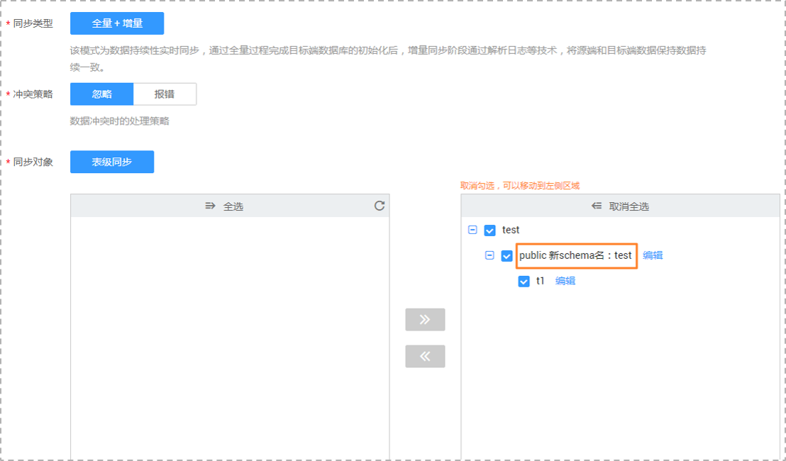

# 表映射

数据复制服务提供的数据同步功能支持表映射，即支持源数据库和目标数据库实例的表名称不同。

本小节主要介绍如何在数据同步任务配置过程中，使用表映射功能。

目前仅在MySQL-\>PostgreSQL的数据同步过程中，如果源数据库和目标数据库中表的名称不同，可以使用数据同步提供的表映射功能进行表名修改。

## 操作步骤

表映射是在创建数据同步任务过程中的设定同步对象阶段进行配置的，以下将对该功能进行详细的介绍。

1.  在“设定同步“页面，同步对象右侧已选对象框中，选择需要进行表映射的数据库表，单击“编辑”按钮。

    **图 1**  表映射  
    

2.  修改表名。

    在“编辑表名“的弹出框中，填写新的表名，修改后的名称即为保存在目标数据库中的表名。

    **图 2**  修改表名  
    

3.  查看修改结果。

    表名修改成功后，您会看到修改前的表名和修改后的新表名，至此，表示完成表映射的配置。

    **图 3**  查看修改结果  
    

