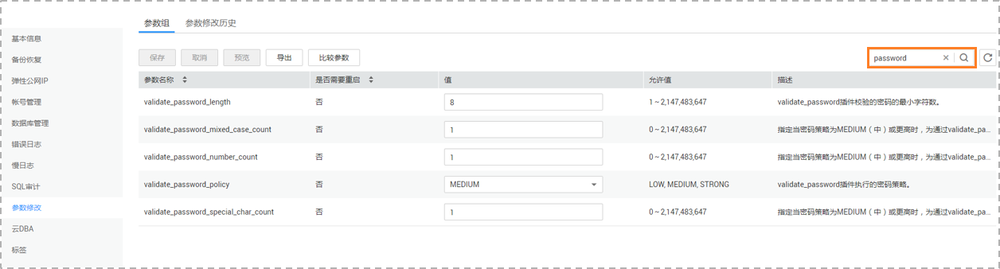
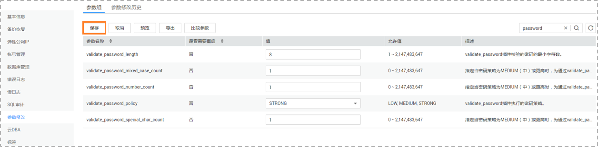

# 设置的密码不符合目标库的密码复杂度要求时，如何修改密码强度

## 操作场景

用户在设置迁移用户密码时，设置的密码不符合目标库的密码复杂度要求，需要按照用户密码复杂度的要求进行密码设置。

## 操作步骤

以下操作适用于目标数据库为RDS实例的情况。

1.  登录关系型数据库服务控制台。
2.  选择指定目标数据库实例。
3.  单击实例名称。
4.  页面跳转至“基本信息”页签，切换至“参数修改”页面。
5.  在页面右上角搜索框，输入关键字“password”，查看搜索结果。

    **图 1**  修改密码  
    

6.  在[5](#li21254109563)的搜索结果中，对于[表1 密码参数](#table1711716281411)列举的参数，需要根据密码复杂度要求进行修改，确保各参数在密码复杂度允许的范围内。

    **表 1**  密码参数

    
    <table><thead align="left"><tr id="row31193281913"><th class="cellrowborder" valign="top" width="28.549999999999997%" id="mcps1.2.4.1.1">
<strong id="b1777316919216">参数</strong>

    </th>
    <th class="cellrowborder" valign="top" width="22.81%" id="mcps1.2.4.1.2">
<strong id="b142268710315">允许值</strong>

    </th>
    <th class="cellrowborder" valign="top" width="48.64%" id="mcps1.2.4.1.3">
<strong id="b16215401435">说明</strong>

    </th>
    </tr>
    </thead>
    <tbody><tr id="row1011912281212"><td class="cellrowborder" valign="top" width="28.549999999999997%" headers="mcps1.2.4.1.1 ">
validate_password_length

    </td>
    <td class="cellrowborder" valign="top" width="22.81%" headers="mcps1.2.4.1.2 ">
0～2,147,483,647

    </td>
    <td class="cellrowborder" valign="top" width="48.64%" headers="mcps1.2.4.1.3 ">
validate_password插件校验的密码的最小字符数。

    </td>
    </tr>
    <tr id="row171202286113"><td class="cellrowborder" valign="top" width="28.549999999999997%" headers="mcps1.2.4.1.1 ">
validate_password_mixed_case_count

    </td>
    <td class="cellrowborder" valign="top" width="22.81%" headers="mcps1.2.4.1.2 ">
0～2,147,483,647

    </td>
    <td class="cellrowborder" valign="top" width="48.64%" headers="mcps1.2.4.1.3 ">
指定当密码策略为MEDIUM（中）或更高时，为通过validate_password校验，密码至少需包含多少个大小写字符。

    </td>
    </tr>
    <tr id="row121202289119"><td class="cellrowborder" valign="top" width="28.549999999999997%" headers="mcps1.2.4.1.1 ">
validate_password_number_count

    </td>
    <td class="cellrowborder" valign="top" width="22.81%" headers="mcps1.2.4.1.2 ">
0～2,147,483,647

    </td>
    <td class="cellrowborder" valign="top" width="48.64%" headers="mcps1.2.4.1.3 ">
指定当密码策略为MEDIUM（中）或更高时，为通过validate_password校验，密码至少需包含多少个数字。

    </td>
    </tr>
    <tr id="row111201128817"><td class="cellrowborder" valign="top" width="28.549999999999997%" headers="mcps1.2.4.1.1 ">
validate_password_policy

    </td>
    <td class="cellrowborder" valign="top" width="22.81%" headers="mcps1.2.4.1.2 ">
LOW, MEDIUM, STRONG

    </td>
    <td class="cellrowborder" valign="top" width="48.64%" headers="mcps1.2.4.1.3 ">
validate_password插件执行的密码策略。

    </td>
    </tr>
    <tr id="row15714891667"><td class="cellrowborder" valign="top" width="28.549999999999997%" headers="mcps1.2.4.1.1 ">
validate_password_special_char_count

    </td>
    <td class="cellrowborder" valign="top" width="22.81%" headers="mcps1.2.4.1.2 ">
0～2,147,483,647

    </td>
    <td class="cellrowborder" valign="top" width="48.64%" headers="mcps1.2.4.1.3 ">
指定当密码策略为MEDIUM（中）或更高时，为通过validate_password校验，密码至少需包含多少个非字母数字字符。

    </td>
    </tr>
    </tbody>
    </table>

7.  密码复杂度修改完成后，保存修改结果。

    **图 2**  保存修改结果  
    

8.  返回数据复制服务的“迁移模式”页面，继续执行下一步操作即可。

